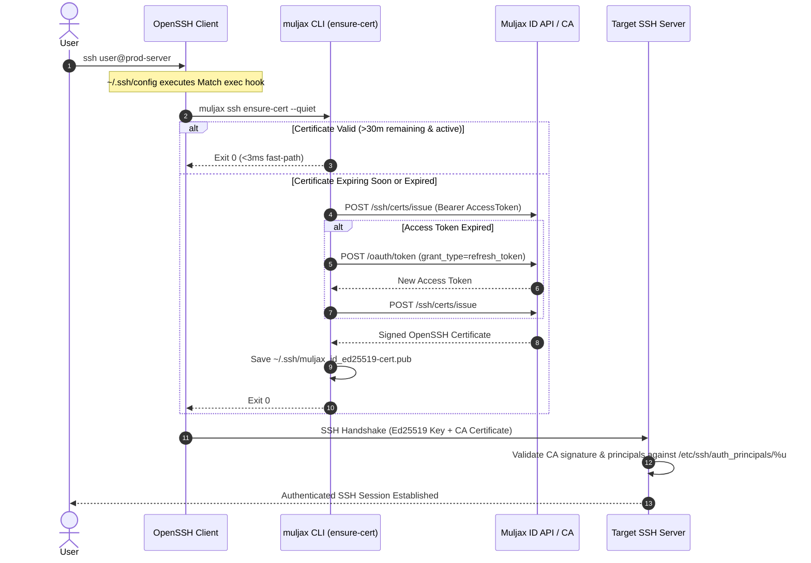

<div align="center">
	
</div>
<br />

---

# Muljax CLI Setup & Integration Guide

Comprehensive guide for configuring the Muljax CLI, client workstations, OpenSSH integration, and target servers.

[](https://golang.org/)
[](https://www.openssh.com/)
[](https://oauth.net/2/)
[](https://www.kernel.org/)
[](https://apple.com/)
[](https://microsoft.com/)

---

## Table of Contents

- [Prerequisites](#prerequisites)
- [Architecture & How It Works](#architecture--how-it-works)
- [Part 1: Client Workstation Setup](#part-1-client-workstation-setup)
  - [1. Installation](#1-installation)
  - [2. Automated Onboarding](#2-automated-onboarding)
  - [3. OpenSSH Client Configuration & Scoping](#3-openssh-client-configuration--scoping)
  - [4. Managing OpenSSH Integration](#4-managing-openssh-integration)
- [Part 2: Command Reference](#part-2-command-reference)
  - [Global Flags](#global-flags)
  - [muljax install & version](#muljax-install--muljax-version)
  - [muljax id auth Commands](#muljax-id-auth-commands)
  - [muljax ssh Commands](#muljax-ssh-commands)
- [Part 3: Target Server Setup](#part-3-target-server-setup)
  - [1. Retrieve CA Public Key](#1-retrieve-the-ca-public-key)
  - [2. Install CA Key on Target Host](#2-install-ca-public-key-on-the-server)
  - [3. Configure OpenSSH Daemon](#3-configure-openssh-daemon)
  - [4. Define Authorized Principals](#4-define-authorized-principals)
  - [5. Validate and Reload sshd](#5-validate-and-reload-ssh-daemon)
- [Part 4: Certificate Lifecycle & Revocation](#part-4-certificate-lifecycle--revocation)
- [Part 5: Configuration & Storage Layout](#part-5-configuration--storage-layout)
- [Part 6: Headless & CI/CD Environments](#part-6-headless--cicd-environments)
- [Part 7: Troubleshooting](#part-7-troubleshooting)

---

## Prerequisites

Before setting up `muljax`, ensure you have:

- An [OpenSSH](https://www.openssh.com/) client (version 7.3 or higher with `Match exec` support).
- A running [Muljax Identity Platform](https://github.com/Muljax/id) instance with the SSH Certificate Authority module enabled.
- Network connectivity to your Muljax ID endpoint (e.g., `https://id.example.com` or `http://localhost:8787`).
- [Go](https://golang.org/) 1.24+ (only if compiling from source).

---

## Architecture & How It Works

Muljax CLI interacts with OpenSSH client hooks to validate and renew short-lived certificates just in time before an SSH connection is made:



---

## Part 1: Client Workstation Setup

### 1. Installation

Download the binary for your OS/architecture from [GitHub Releases](https://github.com/muljax/cli/releases/latest) or install via Go:

```bash
# Linux / macOS
OS="$(uname -s | tr '[:upper:]' '[:lower:]')"
ARCH="$(uname -m | sed -e 's/x86_64/amd64/' -e 's/aarch64/arm64/')"
curl -sLO "https://github.com/muljax/cli/releases/latest/download/muljax_${OS}_${ARCH}.tar.gz"
tar -xzf "muljax_${OS}_${ARCH}.tar.gz" muljax
./muljax install
rm "muljax_${OS}_${ARCH}.tar.gz"
```

Verify the binary:

```bash
muljax version
```

### 2. Automated Onboarding

Run the interactive onboarding wizard:

```bash
muljax ssh setup
```

When prompted:
1. **Target Endpoint**: Enter your Muljax ID endpoint (e.g. `https://id.your-domain.com`, defaulting to `http://localhost:8787`).
2. **Host Scoping**: Enter the host pattern for your servers (e.g. `*.your-domain.com,*.internal`).

*(Tip: For non-interactive scripts, use: `muljax ssh setup --endpoint https://id.example.com --hosts "*.example.com,*.internal"`)*

The onboarding sequence:
1. **Key Generation**: Creates a local Ed25519 key pair at `~/.ssh/muljax_id_ed25519` (`0600`) and `~/.ssh/muljax_id_ed25519.pub` (`0644`).
2. **OAuth 2.0 PKCE**: Opens your default browser to authorize with Muljax ID.
3. **Keyring Storage**: Saves OAuth access & refresh tokens to the OS Keychain (or `~/.config/muljax/tokens.json`).
4. **Certificate Issuance**: Requests a signed user certificate and writes it to `~/.ssh/muljax_id_ed25519-cert.pub`.
5. **OpenSSH Hook**: Injects a scoped `Match host` hook block into `~/.ssh/config`.

### 3. OpenSSH Client Configuration & Scoping

The injected configuration block in `~/.ssh/config` appears as follows:

```sshconfig
# BEGIN MULJAX SSH CONFIG
Match host *.corp.example.com,*.internal exec "muljax ssh ensure-cert --quiet"
    IdentityFile ~/.ssh/muljax_id_ed25519
# END MULJAX SSH CONFIG
```

#### Why Host Scoping Matters
Scoping the `Match host` pattern rather than using `*` is strongly recommended:
- **Zero Overhead on Third-Party Hosts**: Connections to GitHub, GitLab, or personal servers bypass `muljax` completely.
- **Identity Privacy**: Prevents advertising your corporate identity and certificate principals to untrusted remote servers.
- **Prevents `MaxAuthTries` Exhaustion**: Avoids offering unrecognized keys to third-party SSH servers.
- **Offline Reliability**: Local LAN or personal SSH connections remain fully functional when disconnected from the corporate network.

#### Fast Path (<3ms) vs Auto-Renewal
- When you run `ssh user@internal-server`, OpenSSH executes `muljax ssh ensure-cert --quiet`.
- If the certificate is active and has >30 minutes remaining, `muljax` exits immediately with status `0`.
- If the certificate is missing, expired, or expiring within 30 minutes, `muljax` uses the OAuth refresh token to request a new certificate before OpenSSH initiates the handshake.

### 4. Managing OpenSSH Integration

To safely remove the hook from `~/.ssh/config`:

```bash
muljax ssh unhook
```

To re-enable or update the hook later:

```bash
muljax ssh hook --hosts "*.internal,*.example.com"
```

---

## Part 2: Command Reference

### Global Flags

All subcommands accept:

| Flag | Type | Description | Default |
| --- | --- | --- | --- |
| `--config` | string | Path to custom configuration file | `$HOME/.config/muljax/config.json` |
| `--endpoint` | string | Target Muljax ID API endpoint URL | `http://localhost:8787` |
| `-v, --version` | boolean | Display CLI version information | |
| `-h, --help` | boolean | Display help information | |

---

### `muljax install` & `muljax version`

```bash
# Auto-detects /usr/local/bin or ~/.local/bin
./muljax install

# Install for current user only
./muljax install --user

# Install to custom directory
./muljax install --dir /opt/bin

# Display version, git commit, and build date
muljax version
```

---

### `muljax id auth` Commands

Manage identity sessions and OAuth 2.0 tokens:

```bash
# Authenticate via browser PKCE flow
muljax id auth login

# Display current authentication session details and token expiration
muljax id auth status

# Clear session tokens from OS keyring and local storage
muljax id auth logout
```

---

### `muljax ssh` Commands

Manage SSH keys, certificates, automated renewal, and server integration:

```bash
# Full onboarding wizard (interactive or with flags)
muljax ssh setup [--endpoint <url>] [--hosts <pattern>]

# Authenticate and immediately request a fresh certificate
muljax ssh login

# Inspect local certificate (Key ID, Serial, Principals, Validity)
muljax ssh cert

# Force immediate certificate renewal with a custom duration (hours)
muljax ssh cert --renew --ttl 12

# Pre-flight check / auto-renewal hook (used by OpenSSH Match exec)
muljax ssh ensure-cert --quiet

# Check SSH status, local key paths, validity countdown, and live CA revocation
muljax ssh status

# Fetch CA public key and display server setup instructions
muljax ssh server setup

# Add or update ~/.ssh/config integration hook
muljax ssh hook [--hosts <pattern>]

# Remove Muljax integration hook from ~/.ssh/config
muljax ssh unhook
```

---

## Part 3: Target Server Setup

Target servers must trust the Muljax Certificate Authority and map certificate principals to local accounts.

### 1. Retrieve the CA Public Key

On your workstation:

```bash
muljax ssh server setup
```

This retrieves the active CA public key from `/ssh/ca/public-key?format=raw`.

### 2. Install CA Public Key on the Server

On the target Linux/Unix host:

```bash
sudo mkdir -p /etc/ssh
echo "<ca-public-key>" | sudo tee /etc/ssh/muljax_ca.pub
sudo chmod 644 /etc/ssh/muljax_ca.pub
```

### 3. Configure OpenSSH Daemon

Add the following to `/etc/ssh/sshd_config` (or `/etc/ssh/sshd_config.d/muljax.conf`):

```sshconfig
TrustedUserCAKeys /etc/ssh/muljax_ca.pub
AuthorizedPrincipalsFile /etc/ssh/auth_principals/%u
```

### 4. Define Authorized Principals

Create authorized principal mappings for each system account:

```bash
sudo mkdir -p /etc/ssh/auth_principals
sudo chmod 755 /etc/ssh/auth_principals

# Example: Allow users with 'admin' or 'ubuntu' principals to log in as local user 'ubuntu'
echo -e "admin\nubuntu" | sudo tee /etc/ssh/auth_principals/ubuntu
sudo chmod 644 /etc/ssh/auth_principals/*
```

### 5. Validate and Reload SSH Daemon

```bash
# Test sshd syntax
sudo sshd -t

# Reload sshd
sudo systemctl reload sshd
```

---

## Part 4: Certificate Lifecycle & Revocation

- **Validity Duration**: Certificates default to 8 hours (`28,800` seconds).
- **Auto-Renewal Threshold**: When `ensure-cert` runs, any certificate with less than **30 minutes** remaining triggers background renewal via the stored OAuth refresh token.
- **Revocation Checking**: The CLI verifies serial numbers against `/ssh/ca/revoked-keys?format=raw`.
- **Caching**: Revocation checks are cached for 5 minutes (`300` seconds) in `~/.ssh/muljax_id_ed25519-cert.pub.meta.json` to prevent connection latency.
- **Force Check**: Bypass the cache with:
  ```bash
  muljax ssh ensure-cert --force-check
  ```

---

## Part 5: Configuration & Storage Layout

| File / Location | Description | Permissions |
| :--- | :--- | :--- |
| `~/.config/muljax/config.json` | CLI configuration (endpoint, client ID, key name) | `0600` |
| `~/.config/muljax/tokens.json` | File-based token storage fallback (if OS keyring is unavailable) | `0600` |
| `~/.ssh/muljax_id_ed25519` | Workstation Ed25519 private key | `0600` |
| `~/.ssh/muljax_id_ed25519.pub` | Workstation Ed25519 public key | `0644` |
| `~/.ssh/muljax_id_ed25519-cert.pub` | Signed OpenSSH user certificate | `0644` |
| `~/.ssh/muljax_id_ed25519-cert.pub.meta.json` | Cached certificate metadata, serial, and revocation state | `0644` |
| `~/.ssh/config` | OpenSSH client configuration | `0600` |

---

## Part 6: Headless & CI/CD Environments

In headless environments (containers, CI runners, remote bastions):

1. **Automatic Storage Fallback**: If the OS keyring daemon is unavailable, tokens are saved to `~/.config/muljax/tokens.json` with `0600` permissions.
2. **Terminal Login**: If a graphical browser cannot be opened, `muljax` outputs the authorization URL to `stdout` so you can open it on another device.
3. **Pre-Seeded Credentials**: Automated pipelines can pre-populate `~/.config/muljax/tokens.json` or mount service credentials directly.

---

## Part 7: Troubleshooting

### Verbose SSH Diagnostics

Run OpenSSH in verbose mode to trace certificate authentication:

```bash
ssh -vvv user@server.internal
```

Look for:
- `debug1: Executing Match exec "muljax ssh ensure-cert --quiet"`
- `debug1: Will attempt key: ~/.ssh/muljax_id_ed25519 ED25519-CERT`
- `debug1: Server accepts key: ~/.ssh/muljax_id_ed25519 ED25519-CERT`

### Inspecting Local Certificate

Use OpenSSH's built-in key parser:

```bash
ssh-keygen -L -f ~/.ssh/muljax_id_ed25519-cert.pub
```

### Common Issues

| Issue | Cause | Resolution |
| :--- | :--- | :--- |
| `Permission denied (publickey)` | Principal mismatch or missing `/etc/ssh/muljax_ca.pub` on server | Verify `/etc/ssh/auth_principals/%u` on the server contains a principal listed in `muljax ssh cert`. |
| `certificate auto-renewal failed` | Refresh token expired or revoked | Run `muljax ssh login` to re-authenticate with the identity platform. |
| `Match exec` command not found | `muljax` binary not in `PATH` | Run `muljax install` or configure absolute binary path in `~/.ssh/config`. |
| Port conflict during login | Loopback socket blocked | The CLI binds to an ephemeral loopback port (`:0`); ensure local firewall permits loopback sockets. |

