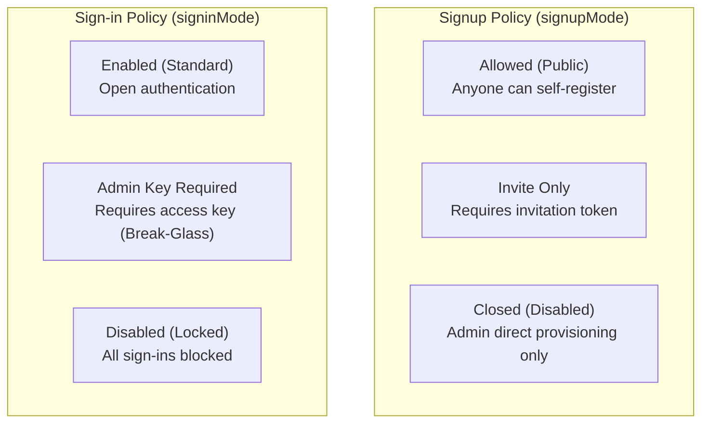

import { Badge, Tabs, TabItem } from '@astrojs/starlight/components';

Muljax ID provides instance-level governance controls that allow administrators to configure tenant registration behavior, sign-in restrictions, invitation tokens, and administrative access keys.

---

## Overview of Tenant Policies

Instance policies are configured under **Admin** -> **Settings** (`/admin/settings`) by operators with the `settings:write` permission.

---

## 1. Registration & Signup Policies

The tenant signup policy dictates how new accounts can be created:

| Signup Mode | Badge | Description | `/register` Behavior | Add User Modal |
| :--- | :--- | :--- | :--- | :--- |
| **`enabled`** | <Badge text="Open" variant="success" /> | Public self-registration is enabled. Anyone can register without a token. | Standard registration form. If an invite token is provided, assigned role is honored. | Both **Invite** and **Direct** tabs active. |
| **`invite`** | <Badge text="Invite Only" variant="caution" /> | Registration requires a valid, pre-generated invitation token. | Prompts for **Invitation Token** input (or auto-filled via `?invite=...`). Rejects submissions without valid token. | Both **Invite** and **Direct** tabs active. |
| **`disabled`** | <Badge text="Closed" variant="danger" /> | Self-registration is completely shut down. | Shows **Registration is closed** banner. Directs users back to login. | **Invite tab is locked/disabled**. Direct creation tab is active. |

### Invitation Token System

Administrators with `users:write` can generate one-time or single-recipient invitation tokens:

1. Navigate to **Admin** -> **Users** (`/admin/users`) and click **Add user**.
2. Select **Generate invite token**.
3. Configure optional parameters:
   - **Recipient Email (Optional)**: If specified, only this exact email address can register using the token.
   - **Initial Role**: Assigns any system or custom role (e.g. `admin`, `user`, `editor`) upon registration.
   - **Expiration (TTL)**: 24 Hours, 3 Days, 7 Days (Default), or 30 Days.
4. Copy the generated one-time link (`https://id.example.com/register?invite=<token>`).

:::note[Single-Use Consumption]
Invite tokens are cryptographically hashed (SHA-256) in the database. When a user submits registration, the token is verified and marked consumed atomically via `used_at = Date.now()`, preventing replay attacks.
:::

---

## 2. Authentication & Sign-in Policies

The sign-in policy controls tenant-wide access to authentication:

| Sign-in Mode | Badge | Standard Users | Administrators (`isUserAdmin`) | `/login` Behavior |
| :--- | :--- | :--- | :--- | :--- |
| **`enabled`** | <Badge text="Standard" variant="success" /> | Normal password and passkey sign-in. | Normal password and passkey sign-in. | Standard login form. |
| **`admin_key`** | <Badge text="Restricted" variant="caution" /> | **Requires valid Admin Access Key**. | **Bypasses key check** (lockout prevention). | Shows **Admin Access Key** input box with key icon. |
| **`disabled`** | <Badge text="Locked" variant="danger" /> | Blocked with `403 Forbidden`. | Blocked with `403 Forbidden`. | Shows **Sign-in is disabled** lock banner. |

### Break-Glass & Admin Bypass Behavior

When `signinMode === "admin_key"`, the system applies a **lockout-prevention bypass**:
- Existing users who satisfy `isUserAdmin(db, userId)` (assigned the built-in `admin` role or any role granting the wildcard `*` permission) can sign in normally with their credentials.
- Non-admin users must provide an active, unexpired admin access key either in the login form or via the `?admin_key=...` query parameter.

:::tip[Maintenance Windows]
Use `admin_key` mode when conducting scheduled maintenance, performing tenant migrations, or staging private deployments. Administrators maintain administrative access while non-operators are locked out unless granted a temporary key.
:::

---

## 3. Admin Sign-in Access Keys

Admin access keys are pre-shared secrets generated by administrators to authorize sign-ins during restricted authentication mode.

### Managing Keys in the Dashboard

Under **Admin** -> **Settings** (`/admin/settings`):
- **Generate Key**: Click **Generate sign-in key**, provide a descriptive name (e.g. *"Maintenance Staging Key"*), and choose an expiration TTL (Never expires, 24 Hours, 7 Days, or 30 Days).
- **One-Time Secret Display**: The secret key (`id_key_...`) is displayed once inside a secure modal with one-click copy.
- **Key Prefix & Telemetry**: Only the SHA-256 hash and the 16-character key prefix (e.g. `id_key_a1b2c3d4...`) are stored in D1. Telemetry records `last_used_at` whenever a key is used.
- **Revocation**: Keys can be revoked instantly at any time by clicking **Revoke**.

---

## 4. Direct User Provisioning

When public signups are disabled or when an administrator needs to provision an account immediately:

1. Open **Admin** -> **Users** -> **Add user**.
2. Select the **Direct user creation** tab.
3. Supply the user's email, select an initial role from the styled role dropdown, and optionally provide a password.
4. If the password field is left empty, the system automatically generates a cryptographically secure temporary password.
5. The generated password is displayed in a copyable card to be shared securely with the user.

---

## 5. Summary Matrix: UI Tab Availability

| Tenant Signup Policy | Add User Modal: Invite Tab | Add User Modal: Direct Tab | Public `/register` | Public `/login` |
| :--- | :--- | :--- | :--- | :--- |
| `signupMode: "enabled"` | ✅ Active | ✅ Active | ✅ Open to public | ✅ Standard |
| `signupMode: "invite"` | ✅ Active | ✅ Active | ⚠️ Requires Token | ✅ Standard |
| `signupMode: "disabled"` | 🔒 Disabled / Greyed out | ✅ Active (Default) | 🛑 Closed banner | 🛑 Closed banner (if signinMode disabled) |
