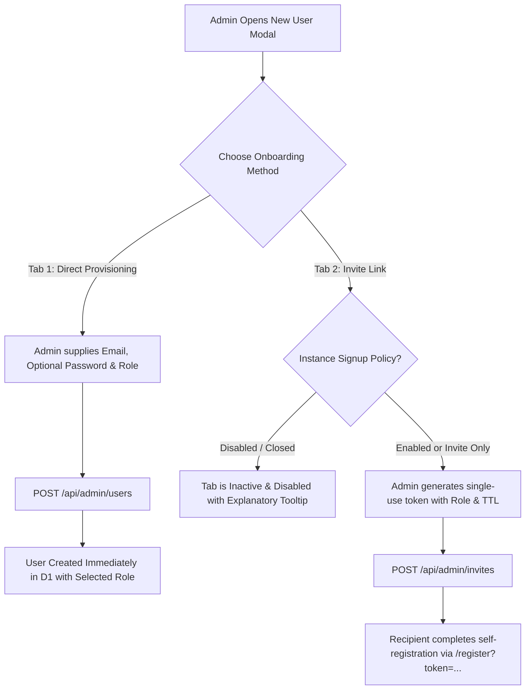
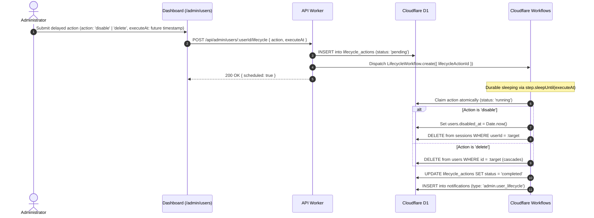

import { Tabs, TabItem, Callout, DatabaseTable, Steps } from '@/components/mdx';

Muljax ID provides automated user lifecycle management for onboarding, suspensions, and offboarding. Account actions can be executed immediately or scheduled for delayed execution via Cloudflare Workflows.

## User Account States & Actions

An account exists in one of two persistent lifecycle states or can be permanently deleted:

- **Active**: The user can authenticate, request SSH certificates, authorize OAuth clients, and manage credentials.
- **Disabled (`disabled_at IS NOT NULL`)**:
  - All existing browser sessions are terminated immediately.
  - All active, unexpired SSH certificates issued to the user are immediately revoked and registered in the Key Revocation List (KRL).
  - SSH certificate requests (`POST /api/ssh/certs/issue`) are rejected.
  - OAuth authorization attempts are blocked.
  - Passkey and password authentication attempts fail with `403 Forbidden`.
- **Permanent Deletion (`delete` action / `DELETE /api/admin/users/:userId`)**:
  - The user record is purged from Cloudflare D1.
  - Foreign key cascades automatically remove all associated sessions, passkeys, user SSH keys, issued SSH certificates, OAuth grants, access tokens, refresh tokens, role assignments, notifications, and scheduled lifecycle actions.
  - User profile avatars stored in Cloudflare R2 are deleted.

<DatabaseTable name="users" />

---

## User Onboarding & Provisioning

Muljax ID supports two administrative onboarding flows accessible directly from **Admin** -> **Users** via the **New User / Invite** modal:



### 1. Direct User Provisioning
- **Endpoint**: `POST /api/admin/users` (Guarded by `users:write`).
- **Behavior**: An administrator directly creates a user record, specifying an email, assigned role, and an optional initial password (auto-generated if omitted).
- **Policy Independence**: Works regardless of the instance signup mode (`enabled`, `invite`, or `disabled`).

### 2. Single-Use Invite Links
- **Endpoint**: `POST /api/admin/invites` (Guarded by `users:write`).
- **Behavior**: Generates a cryptographically random token (`id_inv_...`) with configurable TTL and assigned role.
- **Signup Policy Interplay**:
  - When the instance signup mode is **Closed (`disabled`)**, self-registration is entirely prohibited. The **Invite Link** tab in the admin dashboard modal is automatically disabled/greyed out with an explanatory message instructing the admin to either switch to Direct Provisioning or adjust the instance policy under [Instance Settings & Policies](/admin-guides/instance-settings/).

---

## Managing Lifecycle in the Dashboard

Administrators manage user lifecycles under **Admin** -> **Users** (`/admin/users`):

<Steps>

1. Locate the user in the directory table.

2. Click **Manage** to open the user details drawer.

3. In the **Account Status** section:
   - Click **Active Sessions** to audit all connected devices and geographic locations on an interactive world map, terminate individual suspicious sessions, or bulk force sign-out all sessions.
   - Click **Disable Account** to immediately suspend the account and invalidate active sessions and SSH certificates.
   - Click **Schedule Action** to schedule deactivation or permanent deletion at a future date/time (e.g., end-of-day for departing contractors).
   - Click **Enable Account** to unsuspend a disabled user.
   - Click **Delete User** in the Danger Zone to permanently delete the user account immediately.

</Steps>

<Callout type="caution" title="Sole Administrator Protection">
The system prevents deleting or disabling the last active administrator account, and prevents administrators from deleting or suspending themselves from the administrative interface.
</Callout>

---

## Active Session Auditing & Incident Response

When investigating potential credential compromise or suspicious access:

<Steps>

1. Navigate to **Admin** -> **Users** and click **Active Sessions** on the target user's row or details view.

2. The **Active Sessions** modal provides:
   - **Interactive Geolocation Map**: Real-time visualization of all active device locations on an Esri Dark Gray canvas.
   - **Session Telemetry**: IP address, country, city, browser engine, operating system, creation time, and last active timestamp.
   - **Targeted Revocation**: Revoke an individual session if only one device is suspect (`POST /api/admin/users/:userId/sessions/:sessionId/revoke`).
   - **Bulk Revocation**: Click **Terminate all sessions** to instantly purge all active authenticated sessions for that user across all devices (`POST /api/admin/users/:userId/sessions/revoke-all`).
   - **Disable Account Shortcut**: Directly suspend the entire compromised account from the session modal if full remediation is required.

</Steps>

---

## Delayed Workflows Architecture



<DatabaseTable name="lifecycle_actions" />

---

## API Execution

The lifecycle state is managed via the administrative endpoint:

```http
POST /api/admin/users/:userId/lifecycle
Content-Type: application/json
```

<Tabs>
<TabItem label="Immediate Suspension">

```json
{
  "action": "disable"
}
```

**Effects**:
1. `users.disabledAt` is set to the current timestamp.
2. All records in the `sessions` table for that user are deleted.
3. All active, unexpired SSH certificates belonging to that user are revoked in `ssh_certificates` and added to the host KRL sync.
4. An administrative notification (`admin.user_lifecycle`) is dispatched to all admins.

</TabItem>
<TabItem label="Immediate Activation">

```json
{
  "action": "enable"
}
```

Clears `users.disabledAt`, permitting the user to log in again.

</TabItem>
<TabItem label="Immediate Deletion">

```json
{
  "action": "delete"
}
```

Permanently removes the user record, cascades all associated database entities, and deletes avatars stored in Cloudflare R2. (Alternatively, invoke `DELETE /api/admin/users/:userId`).

</TabItem>
<TabItem label="Scheduled Action">

```json
{
  "action": "delete",
  "executeAt": 1773854200000
}
```

Queues the action in `lifecycle_actions` and dispatches a Cloudflare Workflow instance for durable, delayed execution.

</TabItem>
</Tabs>

<Callout type="tip" title="Durable Execution">
Because delayed tasks run on **Cloudflare Workflows**, executions survive worker restarts, deployments, and edge migrations without requiring external queue infrastructure.
</Callout>

