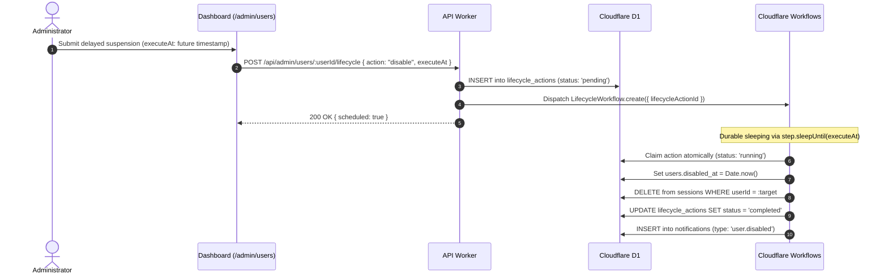

import { Tabs, TabItem } from '@astrojs/starlight/components';

Muljax ID provides automated user lifecycle management for onboarding, suspensions, and offboarding. Account actions can be executed immediately or scheduled for delayed execution via Cloudflare Workflows.

## User Account States

An account exists in one of two core lifecycle states:

- **Active**: The user can authenticate, request SSH certificates, authorize OAuth clients, and manage credentials.
- **Disabled (`disabled_at IS NOT NULL`)**:
  - All existing browser sessions are terminated immediately.
  - SSH certificate requests (`POST /api/ssh/certs/issue`) are rejected.
  - OAuth authorization attempts are blocked.
  - Passkey and password authentication attempts fail with `403 Forbidden`.

---

## Managing Lifecycle in the Dashboard

Administrators manage user lifecycles under **Admin** -> **Users** (`/admin/users`):

1. Locate the user in the directory table.
2. Click **Manage** to open the user details drawer.
3. In the **Account Status** section:
   - Click **Suspend Account** to immediately disable the account.
   - Click **Schedule Suspension** to set a future date/time (e.g., end-of-day for departing contractors).
   - Click **Restore Account** to unsuspend a disabled user.

:::caution
Administrators cannot suspend their own account. The system rejects self-deactivation to prevent accidental admin lockouts.
:::

---

## Delayed Workflows Architecture



---

## API Execution

The lifecycle state is managed via the administrative endpoint:

```http
POST /api/admin/users/:userId/lifecycle
Content-Type: application/json
```

<Tabs>
  <TabItem label="Immediate Suspension">

```json
{
  "action": "disable"
}
```

**Effects**:
1. `users.disabledAt` is set to the current timestamp.
2. All records in the `sessions` table for that user are deleted.
3. An administrative notification (`user.disabled`) is dispatched to all admins.

  </TabItem>
  <TabItem label="Immediate Activation">

```json
{
  "action": "enable"
}
```

Clears `users.disabledAt`, permitting the user to log in again.

  </TabItem>
  <TabItem label="Scheduled Action">

```json
{
  "action": "disable",
  "executeAt": 1773854200000
}
```

Queues the action in `lifecycle_actions` and dispatches a Cloudflare Workflow instance.

  </TabItem>
</Tabs>

:::tip[Durable Execution]
Because delayed tasks run on **Cloudflare Workflows**, executions survive worker restarts, deployments, and edge migrations without requiring external queue infrastructure.
:::
