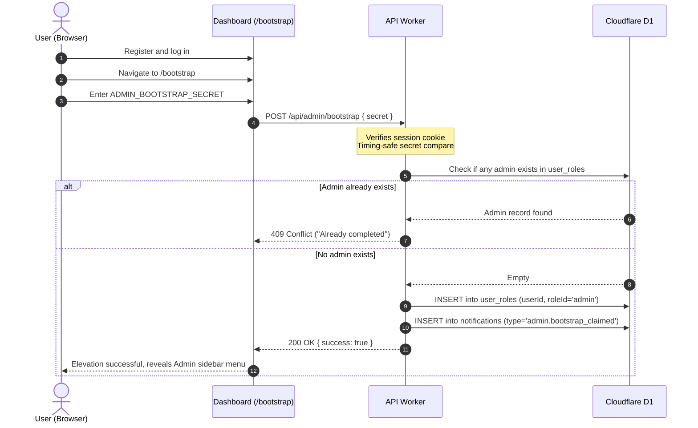

import { Steps, Callout, Badge } from '@/components/mdx';

When an instance is deployed for the first time, no user holds administrator rights. To prevent unauthorized takeover, claiming the initial superadmin role requires a multi-step ceremony using the dashboard and the `ADMIN_BOOTSTRAP_SECRET` configured in your `.env`.

## The Bootstrap Sequence

---

## Step-by-Step Instructions

<Steps>

1. **Register an Account**:
   - Open your dashboard in your browser (e.g., `https://dash.example.com`).
   - Navigate to `/register`.
   - Create your account using your email address and choose either a password or WebAuthn passkey.
   - Complete login to establish an active session cookie.

2. **Access the Bootstrap Form**:
   - In your browser address bar, navigate to `/bootstrap` (e.g., `https://dash.example.com/bootstrap`).
   - Enter the exact `ADMIN_BOOTSTRAP_SECRET` string from your `.env`.
   - Click **Claim Administrator Privileges**.

3. **Confirm Elevation**:
   - The dashboard calls the internal `bootstrapAdmin` handler.
   - Upon successful verification, your user account is assigned the `admin` role (`SYSTEM_ROLE_IDS.ADMIN`).
   - An in-app notification (`admin.bootstrap_claimed`) confirms your elevation.
   - The dashboard updates your permissions and reveals the **Admin** navigation menu in the sidebar.

</Steps>

<Callout type="note" title="Pre-Seeded Roles & One-Time Operation">
The `admin`, `user`, and `everyone` roles, along with system permissions and the official `muljax-cli` OAuth client, are automatically pre-seeded into Cloudflare D1 during deployment (`bun run deploy` / `bun run seed`).

Once any user claims the administrator role, all subsequent attempts to use the bootstrap secret are rejected with `409 Conflict` (`"Admin bootstrap has already been completed."`).
</Callout>

<Callout type="tip" title="Security Guarantees">
- **Timing-Safe Comparison**: Secret validation uses WebCrypto `timingSafeEqual` to eliminate side-channel timing analysis.
- **Session Required**: Anonymous callers receive `401 Unauthorized`.
- **Hidden Route**: The `/bootstrap` link is automatically hidden from standard navigation once an administrator exists.
</Callout>

