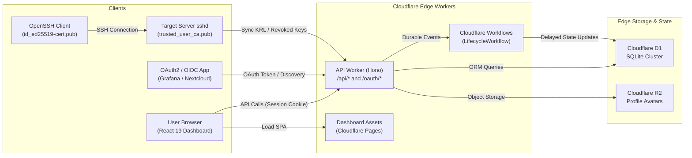

import { FileTree, Callout, Card, CardGrid } from '@/components/mdx';

Muljax ID is engineered specifically for serverless edge environments, eliminating traditional container infrastructure and relational database clusters in favor of Cloudflare's distributed primitives.

## Component Topology

<Callout type="note" title="Edge Execution Guarantees">
API workers execute within V8 isolates with zero disk storage. State transitions and transactions are pushed directly to Cloudflare D1 with automatic query replication.
</Callout>

---

## Edge Service Layers

### Edge API (`apps/api`)

The API service runs within Cloudflare Workers using the [Hono](https://hono.dev) framework:

- **Routing and Middleware**:
  - Global CORS middleware (`/api/*`) restricting cross-origin requests to configured dashboard origins.
  - Session verification middleware validating token hashes against `sessions` table.
  - Role-based authorization middleware verifying user permission flags.
- **Scheduled Workers**:
  - Cloudflare Workers `scheduled()` cron handler runs `cleanupExpiredAuthData` to purge expired sessions, authorization codes, stale passkey challenges, password reset tokens, and expired SSH certificates (whether or not revoked) from D1.
- **Durable Workflows**:
  - `LifecycleWorkflow` extends Cloudflare `WorkflowEntrypoint` to manage asynchronous delays (e.g., executing account deactivation after a grace period).

### Management Dashboard (`apps/dashboard`)

The user and administrative console is a client-side single-page application built on:
- **React 19** with TypeScript.
- **TanStack Router**: File-system based type-safe routing.
- **TanStack Query**: Request caching, background refetching, and optimistic mutations.
- **Tailwind CSS**: Modern accessible dark theme.

### Core Cryptography & SSH Engine (`packages/crypto`)

The zero-dependency cryptographic and protocol kernel is packaged as `@id/crypto`:
- **Bytes**: Constant-time Base64 and Base64URL codecs.
- **Hashing**: Argon2id password hashing via WASM, cryptographic token generation, and constant-time comparison (`timingSafeEqual`).
- **JWT & OIDC**: ES256 / ECDSA P-256 key management, PKCE S256 challenge generation, and RFC 9068 `at+jwt` token minting.
- **SSH Engine**: RFC 4251 binary wire serialization (`SSHWriter`, `SSHReader`), OpenSSH user certificate issuance, POSIX principal derivation, and binary Key Revocation List (`PROTOCOL.krl`) generation.

### Database Layer (`Cloudflare D1`)

Data persistence is handled by Cloudflare D1, an edge-distributed SQLite database managed through [Drizzle ORM](https://orm.drizzle.team):
- Automatic edge replication with zero connection pool limits.
- Foreign key constraints with cascading deletes enabled.
- Composite indexing for high-frequency queries (e.g., `(user_id, client_id)`, `(serial)`).

---

## Storage & Module Layout

<FileTree>
- apps/
  - api/ Cloudflare Worker API (Hono, D1 SQLite, Drizzle ORM)
    - src/
      - db/ D1 schema modules and migrations
      - lib/ Lifecycle, notifications, RBAC, and crypto re-exports
      - middleware/ CORS, authentication, and RBAC guards
      - routes/ REST API, OAuth2/OIDC, passkeys, SSH CA routes
  - dashboard/ SPA console (React 19, TanStack Router, Vite)
  - docs/ Documentation site (Vite, React, MDX)
- packages/
  - crypto/ Standalone cryptographic kernel (@id/crypto)
    - src/
      - bytes/ Base64 / Base64URL codecs
      - hashing/ Argon2id, token hashing, timing-safe compare
      - jwt/ ES256 key signing, OIDC ID tokens, PKCE
      - ssh/ RFC 4251 wire format, certificate minting, KRL
      - webauthn/ WebAuthn binary serialization helpers
</FileTree>
