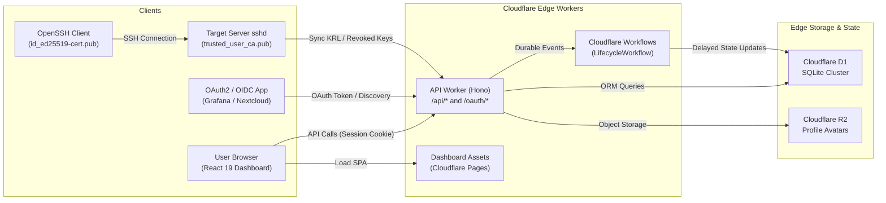

import { FileTree } from '@astrojs/starlight/components';

Muljax ID is engineered specifically for serverless edge environments, eliminating traditional container infrastructure and relational database clusters in favor of Cloudflare's distributed primitives.

## Component Topology

---

## Edge Service Layers

### Edge API (`apps/api`)

The API service runs within Cloudflare Workers using the [Hono](https://hono.dev) framework:

- **Routing and Middleware**:
  - Global CORS middleware (`/api/*`) restricting cross-origin requests to configured dashboard origins.
  - Session verification middleware validating token hashes against `sessions` table.
  - Role-based authorization middleware verifying user permission flags.
- **Scheduled Workers**:
  - Cloudflare Workers `scheduled()` cron handler runs `cleanupExpiredAuthData` to purge expired sessions, authorization codes, stale passkey challenges, password reset tokens, and expired SSH certificates (whether or not revoked) from D1.
- **Durable Workflows**:
  - `LifecycleWorkflow` extends Cloudflare `WorkflowEntrypoint` to manage asynchronous delays (e.g., executing account deactivation after a grace period).

### Management Dashboard (`apps/dashboard`)

The user and administrative console is a client-side single-page application built on:
- **React 19** with TypeScript.
- **TanStack Router**: File-system based type-safe routing.
- **TanStack Query**: Request caching, background refetching, and optimistic mutations.
- **Tailwind CSS**: Modern accessible dark theme.

### Database Layer (`Cloudflare D1`)

Data persistence is handled by Cloudflare D1, an edge-distributed SQLite database managed through [Drizzle ORM](https://orm.drizzle.team):
- Automatic edge replication with zero connection pool limits.
- Foreign key constraints with cascading deletes enabled.
- Composite indexing for high-frequency queries (e.g., `(user_id, client_id)`, `(serial)`).

---

## Storage & Module Layout

<FileTree>
- apps/api/src/
  - db/
    - index.ts D1 client instantiation with Drizzle
    - schema/ 11 schema modules defining SQLite tables
  - lib/
    - auth/ Password hashing, WebAuthn verification, session tokens
    - lifecycle/ Lifecycle execution engine and workflow hooks
    - oauth/ JWT signer, JWKS, token hashes, PKCE validation
    - rbac/ Permission definitions and role evaluation
    - ssh/ RFC 4251 wire format, OpenSSH certificate serialization
  - middleware/ CORS, authentication, and RBAC guards
  - routes/
    - account/ User self-service profile and credential endpoints
    - admin/ Operator administrative endpoints
    - auth/ Login, logout, session verification
    - oauth/ Standard RFC 6749 OAuth2 & OIDC endpoints
    - passkeys/ WebAuthn registration and authentication ceremonies
    - ssh/ CA key distribution, cert issue, KRL sync
    - well-known/ OpenID Discovery and JWKS endpoints
  - workflows/
    - lifecycle.ts Cloudflare Workflow durable entrypoint
</FileTree>
