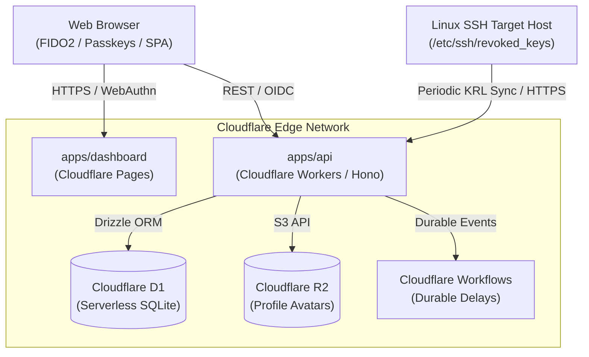

import { Card, CardGrid } from '@astrojs/starlight/components';

`ID` is a lightweight, edge-native identity and access management system built directly on Cloudflare Workers and Cloudflare D1. It serves as both a centralized OpenID Connect (OIDC) / OAuth 2.0 provider and an enterprise-grade OpenSSH Certificate Authority (CA).

## Key Capabilities

<CardGrid>
  <Card title="FIDO2 / WebAuthn Passkeys" icon="seti:lock">
    Passwordless authentication supporting biometric authenticators (Touch ID, Windows Hello, Face ID) and hardware security tokens (YubiKeys).
  </Card>
  <Card title="OpenSSH Certificate Authority" icon="seti:key">
    Native binary certificate issuing engine conforming to RFC 4251 and OpenSSH CERT01 specifications for client authentication.
  </Card>
  <Card title="Strict Ed25519 Cryptography" icon="shield">
    Enforces modern, elliptic-curve public key cryptography (`ssh-ed25519`) for user keys and CA signing operations.
  </Card>
  <Card title="Key Revocation List (KRL) Sync" icon="setting">
    Dynamic revocation endpoint (`/api/ssh/ca/revoked-keys`) compatible with OpenSSH `RevokedKeys` via systemd services and timers.
  </Card>
  <Card title="OAuth 2.0 & OpenID Connect" icon="seti:json">
    Compliant authorization server supporting Authorization Code Flow with PKCE (RFC 7636), JWKS key sets, and OIDC discovery.
  </Card>
  <Card title="User Lifecycle Workflows" icon="rocket">
    User state machine (`active`, `disabled`) integrated with Cloudflare Workflows for delayed, durable background task execution.
  </Card>
</CardGrid>

---

## System Topology

---

## Monorepo Architecture

The system is structured as a Bun monorepo comprising three applications:

- **`apps/api`**: Cloudflare Worker running [Hono](https://hono.dev), interfacing with Cloudflare D1 (SQLite) via [Drizzle ORM](https://orm.drizzle.team).
- **`apps/dashboard`**: Single-Page Application (SPA) built with React 19, TanStack Router, TanStack Query, and Tailwind CSS, deployed to Cloudflare Pages.
- **`apps/docs`**: Documentation portal built with Astro Starlight.
