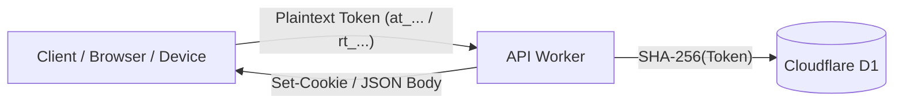
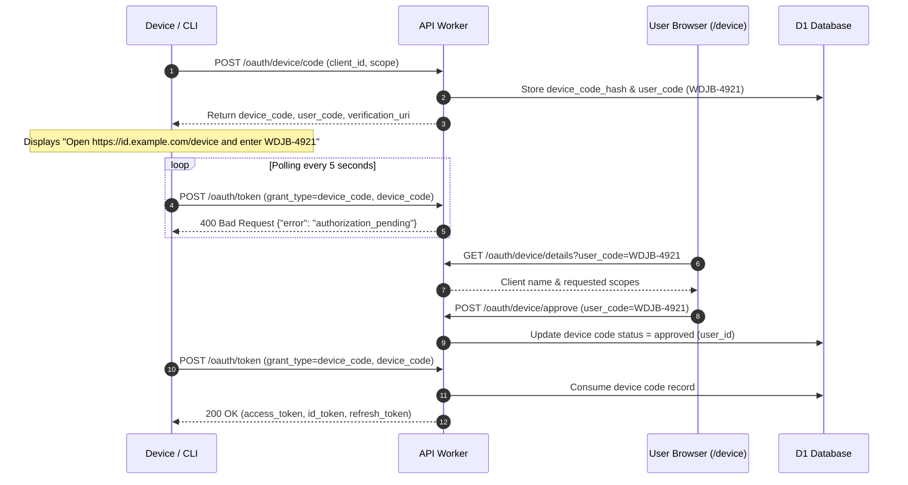

import { DatabaseTable, Callout, Badge } from '@/components/mdx';

Muljax ID provides an edge-native OpenID Connect Core 1.0 and OAuth 2.0 (RFC 6749) authorization server engineered for Cloudflare Workers. It implements cryptographic verification at rest, zero plaintext token persistence, timing-safe PKCE validation, and ECDSA P-256 (`ES256`) JSON Web Token (JWT) signing.

---

## 1. Standards Catalog & Citations

The OAuth2 / OIDC subsystem complies with the following RFCs and OpenID Foundation standards:

- **[RFC 6749](https://www.rfc-editor.org/rfc/rfc6749)**: *The OAuth 2.0 Authorization Framework* (Authorization Code, Refresh Token, and Client Credentials grants).
- **[RFC 7636](https://www.rfc-editor.org/rfc/rfc7636)**: *Proof Key for Code Exchange by OAuth Public Clients (PKCE)* (mandating `code_challenge_method=S256`).
- **[RFC 8628](https://www.rfc-editor.org/rfc/rfc8628)**: *OAuth 2.0 Device Authorization Grant* (Device authorization for browserless and input-constrained devices).
- **[OpenID Connect Core 1.0](https://openid.net/specs/openid-connect-core-1_0.html)**: ID Tokens, Userinfo claims, and authentication contexts.
- **[RFC 7515](https://www.rfc-editor.org/rfc/rfc7515)**: *JSON Web Signature (JWS)* (ECDSA P-256 with SHA-256).
- **[RFC 7517](https://www.rfc-editor.org/rfc/rfc7517)**: *JSON Web Key (JWK)* and JWKS endpoint specifications.
- **[RFC 7519](https://www.rfc-editor.org/rfc/rfc7519)**: *JSON Web Token (JWT)* claims and structure.
- **[RFC 7009](https://www.rfc-editor.org/rfc/rfc7009)**: *OAuth 2.0 Token Revocation*.
- **[RFC 7662](https://www.rfc-editor.org/rfc/rfc7662)**: *OAuth 2.0 Token Introspection*.
- **[RFC 8414](https://www.rfc-editor.org/rfc/rfc8414)**: *OAuth 2.0 Authorization Server Metadata* (`/.well-known/openid-configuration`).

---

## 2. Token Architecture & Storage at Rest

Tokens and secrets are never persisted in plaintext. Every credential stored in Cloudflare D1 is transformed into a SHA-256 cryptographic digest before writing to the database:



### Database Schemas

<DatabaseTable name="oauth_clients" />

<DatabaseTable name="oauth_authorization_codes" />

<DatabaseTable name="oauth_device_codes" />

<DatabaseTable name="oauth_access_tokens" />

<DatabaseTable name="oauth_refresh_tokens" />

<DatabaseTable name="oauth_grants" />

---

## 3. PKCE S256 Cryptographic Verification

In compliance with RFC 7636 and current OAuth 2.1 recommendations, PKCE is enforced with `code_challenge_method=S256`. The legacy `plain` transform is rejected.

### Mathematical Specification
1. The client generates an unguessable high-entropy cryptographic string `V` (`code_verifier`) containing between 43 and 128 characters from the unreserved set `[A-Z, a-z, 0-9, -, ., _, ~]`.
2. The client calculates the code challenge `C`:
```text
C = BASE64URL(SHA256(ASCII(V)))
```
3. The server validates the code verifier upon exchange:

```ts
// apps/api/src/lib/oauth/pkce.ts
export async function createCodeChallenge(codeVerifier: string): Promise<string> {
    const data = new TextEncoder().encode(codeVerifier);
    const hash = await crypto.subtle.digest("SHA-256", data);
    return base64UrlEncode(new Uint8Array(hash));
}

export async function verifyCodeChallenge(
    codeVerifier: string,
    codeChallenge: string,
): Promise<boolean> {
    const expected = await createCodeChallenge(codeVerifier);
    return timingSafeEqual(expected, codeChallenge);
}
```

Validation uses constant-time comparison (`timingSafeEqual`) to eliminate side-channel timing attacks.

---

## 4. ID Token Minting (ECDSA P-256 / ES256)

OpenID Connect ID Tokens are issued as compact JSON Web Signatures (JWS) signed using the server's extractable ECDSA P-256 private key stored in `terraform.tfvars`.

### Cryptographic Parameters
- **Algorithm**: `ES256` (ECDSA using P-256 curve and SHA-256 hash).
- **Key Identifier (`kid`)**: `"Muljax-id-1"`.
- **Key Type (`kty`)**: `"EC"`.
- **Curve (`crv`)**: `"P-256"`.

---

## 5. Token Exchange Flow

Once an authorization code is obtained via the browser consent screen or a device authorization is approved, it is exchanged at `/oauth/token`.

```json title="Token Response Example"
{
  "access_token": "at_9b2e04cf4847e30d",
  "token_type": "Bearer",
  "expires_in": 3600,
  "refresh_token": "rt_81f09c88210e4a7b",
  "id_token": "eyJhbGciOiJFUzI1NiIsImtpZCI6Ik11bGpheC1pZC0xIn0...",
  "scope": "openid profile email offline_access"
}
```

---

## 6. Device Authorization Grant (RFC 8628)

Muljax ID implements **OAuth 2.0 Device Authorization Grant ([RFC 8628](https://www.rfc-editor.org/rfc/rfc8628))**, enabling browser-constrained devices, remote SSH sessions, CLI tooling (`muljax auth login`), and headless servers to authenticate securely.



### 1. Device Authorization Request (`POST /oauth/device/code`)
Clients initiate the grant by providing their client ID and optional requested scopes:

```http
POST /oauth/device/code HTTP/1.1
Host: id.example.com
Content-Type: application/x-www-form-urlencoded

client_id=muljax-cli&scope=openid%20profile%20email%20ssh%3Acert%3Aissue
```

#### Response (`200 OK`)
```json
{
  "device_code": "gm4d8g92hj3k4l5m6n7p8q9r0s1t2u3v4w5x6y7z",
  "user_code": "WDJB-4921",
  "verification_uri": "https://id.example.com/device",
  "verification_uri_complete": "https://id.example.com/device?user_code=WDJB-4921",
  "expires_in": 600,
  "interval": 5
}
```

- **`user_code`**: 8-character human-friendly alphanumeric string formatted as `XXXX-XXXX`. Uses a base-20 alphabet (`BCDFGHJKLMNPQRSTVWXZ23456789`) that removes visually ambiguous characters (`0`, `O`, `1`, `I`, `L`).
- **`verification_uri_complete`**: Pre-populates the activation code for one-click browser approval.
- **`interval`**: Minimum polling interval in seconds enforced by the server.

### 2. Interactive Verification (`/device`)
The user visits `/device` in the Dashboard, reviews the client name and requested permission badges, and clicks **Connect Device**.

### 3. Token Polling & Rate Limiting (`POST /oauth/token`)
The client polls the token endpoint using the `urn:ietf:params:oauth:grant-type:device_code` grant:

```http
POST /oauth/token HTTP/1.1
Host: id.example.com
Content-Type: application/x-www-form-urlencoded

grant_type=urn%3Aietf%3Aparams%3Aoauth%3Agrant-type%3Adevice_code
&device_code=gm4d8g92hj3k4l5m6n7p8q9r0s1t2u3v4w5x6y7z
&client_id=muljax-cli
```

- **Pending**: Returns `400 Bad Request` with `{"error": "authorization_pending"}` while awaiting user confirmation.
- **Slow Down**: If polled more frequently than `interval` seconds, returns `400 Bad Request` with `{"error": "slow_down"}` and increases the interval by 5 seconds.
- **Approved**: Returns standard OAuth tokens and deletes the device code to prevent replay.

---

## 7. Public Metadata & Cryptographic Discovery

### Discovery Document (`/.well-known/openid-configuration`)
Provides standard RFC 8414 server metadata:

```json
{
  "issuer": "https://id-api.example.com",
  "authorization_endpoint": "https://id-api.example.com/oauth/authorize",
  "token_endpoint": "https://id-api.example.com/oauth/token",
  "userinfo_endpoint": "https://id-api.example.com/oauth/userinfo",
  "revocation_endpoint": "https://id-api.example.com/oauth/revoke",
  "introspection_endpoint": "https://id-api.example.com/oauth/introspect",
  "device_authorization_endpoint": "https://id-api.example.com/oauth/device/code",
  "jwks_uri": "https://id-api.example.com/.well-known/jwks.json",
  "response_types_supported": ["code"],
  "grant_types_supported": [
    "authorization_code",
    "refresh_token",
    "client_credentials",
    "urn:ietf:params:oauth:grant-type:device_code"
  ],
  "subject_types_supported": ["public"],
  "id_token_signing_alg_values_supported": ["ES256"],
  "scopes_supported": ["openid", "profile", "email"],
  "token_endpoint_auth_methods_supported": ["client_secret_basic", "client_secret_post", "none"],
  "revocation_endpoint_auth_methods_supported": ["client_secret_basic", "client_secret_post", "none"],
  "introspection_endpoint_auth_methods_supported": ["client_secret_basic", "client_secret_post", "none"],
  "code_challenge_methods_supported": ["S256"],
  "request_parameter_supported": true,
  "claims_parameter_supported": true,
  "request_object_signing_alg_values_supported": ["none"]
}
```

### JSON Web Key Set (`/.well-known/jwks.json`)
Exposes the public key used to verify `id_token` signatures:

```json
{
  "keys": [
    {
      "kty": "EC",
      "crv": "P-256",
      "alg": "ES256",
      "use": "sig",
      "kid": "Muljax-id-1",
      "x": "W4o3L8yv4N0jA8m-sR9Q7x1z2...",
      "y": "K9p2M1n0B7v6C5x4Z3a2S1d0..."
    }
  ]
}
```

---

## 8. Error Handling, Redirection & Security Mitigations

### 1. Authorization Endpoint Redirection vs. HTTP 400 (RFC 6749 §4.1.2.1 / OIDC Core §3.1.2.6)
- **Non-Redirectable Errors**: If the authorization request fails due to a missing or invalid `client_id` or an unregistered `redirect_uri`, the server **MUST NOT** redirect the user-agent. It responds directly with HTTP `400 Bad Request` JSON to prevent open redirect vulnerabilities.
- **Redirectable Errors**: Once `client_id` and `redirect_uri` are verified against the client registration, subsequent errors (e.g. `unsupported_response_type`, PKCE validation failures, `invalid_scope`, `temporarily_unavailable`) are returned via a `302 Found` redirect to the validated `redirect_uri` with `error`, `error_description`, and `state` parameters in the query component.

### 2. OIDC `prompt=none` Silent Authentication (OIDC Core §3.1.2.1)
When `prompt=none` is requested:
- If the user is unauthenticated or their session has expired, the server redirects to `redirect_uri` with `error=login_required`.
- If the user is authenticated but has not pre-granted consent for the requested scopes, the server redirects with `error=consent_required` and description `"Consent is required for prompt=none."`, ensuring no interactive consent UI is rendered.

### 3. Userinfo Endpoint Scope Gating (OIDC Core §5.3.1 / RFC 6750 §3.1)
- The `/oauth/userinfo` endpoint requires an access token containing the `openid` scope.
- Requests without a valid `openid` scope return `403 Forbidden` with `{ "error": "insufficient_scope" }` and the `WWW-Authenticate: Bearer error="insufficient_scope"` challenge header.
- Malformed or invalid tokens return `401 Unauthorized` with `WWW-Authenticate: Bearer error="invalid_token"`.

### 4. Code Reuse & Refresh Token Revocation
- In accordance with RFC 6749 §4.1.2 and OAuth 2.1 recommendations, authorization codes and approved device codes are strictly single-use.
- If an authorization code is presented more than once, the server immediately revokes all access and refresh tokens previously issued by that authorization code.

### Summary of OAuth Error Codes

| Error Code | HTTP Status / Transport | Trigger Condition |
| :--- | :--- | :--- |
| `invalid_request` | `400 Bad Request` or `302 Redirect` | Missing required parameters (`client_id`, `redirect_uri`, `device_code`, or `code_verifier`). |
| `invalid_client` | `401 Unauthorized` | Client authentication failed (invalid `client_secret` or unrecognized `client_id`). |
| `invalid_grant` | `400 Bad Request` | Authorization code or device code expired, already used, or PKCE verifier mismatch. |
| `authorization_pending` | `400 Bad Request` | RFC 8628 device code poll while user approval is still pending. |
| `slow_down` | `400 Bad Request` | RFC 8628 device code polled faster than allowed interval. |
| `expired_token` | `400 Bad Request` | RFC 8628 device authorization request expired before user confirmation. |
| `access_denied` | `403 Forbidden` or `400 Bad Request` | User explicitly denied the consent prompt or device activation. |
| `unauthorized_client` | `400 Bad Request` or `302 Redirect` | Client not authorized to use the requested grant type. |
| `unsupported_response_type` | `302 Redirect` | Requested `response_type` other than `code`. |
| `unsupported_grant_type` | `400 Bad Request` | Grant type other than supported grant types. |
| `invalid_scope` | `400 Bad Request` or `302 Redirect` | Requested scopes exceed client configuration or user approval. |
| `login_required` | `302 Redirect` | `prompt=none` requested without an active user session. |
| `consent_required` | `302 Redirect` | `prompt=none` requested without prior granted consent. |
| `insufficient_scope` | `403 Forbidden` | Access token missing the required `openid` scope on `/oauth/userinfo`. |
