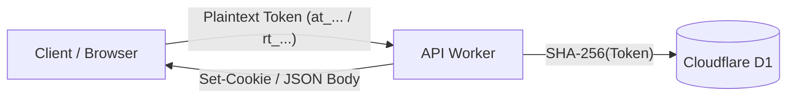
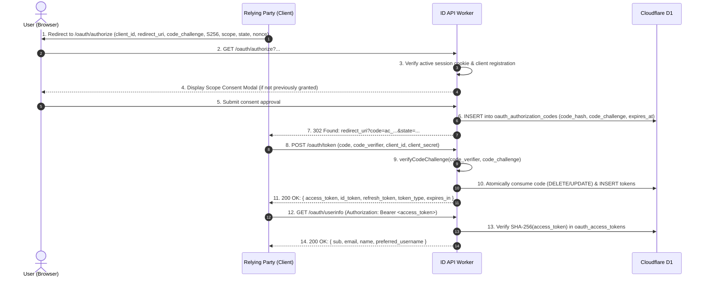

Muljax ID provides an edge-native OpenID Connect Core 1.0 and OAuth 2.0 (RFC 6749) authorization server engineered for Cloudflare Workers. It implements cryptographic verification at rest, zero plaintext token persistence, timing-safe PKCE validation, and ECDSA P-256 (`ES256`) JSON Web Token (JWT) signing.

---

## 1. Standards Catalog & Citations

The OAuth2 / OIDC subsystem complies with the following RFCs and OpenID Foundation standards:

- **[RFC 6749](https://www.rfc-editor.org/rfc/rfc6749)**: *The OAuth 2.0 Authorization Framework* (Authorization Code, Refresh Token, and Client Credentials grants).
- **[RFC 7636](https://www.rfc-editor.org/rfc/rfc7636)**: *Proof Key for Code Exchange by OAuth Public Clients (PKCE)* (mandating `code_challenge_method=S256`).
- **[OpenID Connect Core 1.0](https://openid.net/specs/openid-connect-core-1_0.html)**: ID Tokens, Userinfo claims, and authentication contexts.
- **[RFC 7515](https://www.rfc-editor.org/rfc/rfc7515)**: *JSON Web Signature (JWS)* (ECDSA P-256 with SHA-256).
- **[RFC 7517](https://www.rfc-editor.org/rfc/rfc7517)**: *JSON Web Key (JWK)* and JWKS endpoint specifications.
- **[RFC 7519](https://www.rfc-editor.org/rfc/rfc7519)**: *JSON Web Token (JWT)* claims and structure.
- **[RFC 7009](https://www.rfc-editor.org/rfc/rfc7009)**: *OAuth 2.0 Token Revocation*.
- **[RFC 7662](https://www.rfc-editor.org/rfc/rfc7662)**: *OAuth 2.0 Token Introspection*.
- **[RFC 8414](https://www.rfc-editor.org/rfc/rfc8414)**: *OAuth 2.0 Authorization Server Metadata* (`/.well-known/openid-configuration`).

---

## 2. Token Architecture & Storage at Rest

Tokens and secrets are never persisted in plaintext. Every credential stored in Cloudflare D1 is transformed into a SHA-256 cryptographic digest before writing to the database:



### Database Entities (`apps/api/src/db/schema/`)

| Database Table | Primary Identifier | Security Transform at Rest | Expiration / TTL |
| :--- | :--- | :--- | :--- |
| **`oauth_clients`** | Muljax ID (`client_id`) | Client secrets hashed with SHA-256 (`client_secret_hash`) | Permanent until deleted |
| **`oauth_authorization_codes`** | `code_hash` (PK) | Ephemeral codes hashed with SHA-256 | **10 minutes** (single-use enforced) |
| **`oauth_access_tokens`** | `token_hash` (PK) | Access tokens hashed with SHA-256 | **1 hour** (3600 seconds) |
| **`oauth_refresh_tokens`** | `token_hash` (PK) | Refresh tokens hashed with SHA-256 | **30 days** (revocable) |
| **`oauth_grants`** | `(user_id, client_id)` | JSON-encoded approved scopes | Persisted until revoked by user |

---

## 3. PKCE S256 Cryptographic Verification

In compliance with RFC 7636 and current OAuth 2.1 recommendations, PKCE is enforced with `code_challenge_method=S256`. The legacy `plain` transform is rejected.

### Mathematical Specification
1. The client generates an unguessable high-entropy cryptographic string `V` (`code_verifier`) containing between 43 and 128 characters from the unreserved set `[A-Z, a-z, 0-9, -, ., _, ~]`.
2. The client calculates the code challenge `C`:
```text
C = BASE64URL(SHA256(ASCII(V)))
```
3. The server validates the code verifier upon exchange:

```ts
// apps/api/src/lib/oauth/pkce.ts
export async function createCodeChallenge(codeVerifier: string): Promise<string> {
    const data = new TextEncoder().encode(codeVerifier);
    const hash = await crypto.subtle.digest("SHA-256", data);
    return base64UrlEncode(new Uint8Array(hash));
}

export async function verifyCodeChallenge(
    codeVerifier: string,
    codeChallenge: string,
): Promise<boolean> {
    const expected = await createCodeChallenge(codeVerifier);
    return timingSafeEqual(expected, codeChallenge);
}
```

Validation uses constant-time comparison (`timingSafeEqual`) to eliminate side-channel timing attacks.

---

## 4. ID Token Minting (ECDSA P-256 / ES256)

OpenID Connect ID Tokens are issued as compact JSON Web Signatures (JWS) signed using the server's extractable ECDSA P-256 private key stored in `terraform.tfvars`.

### Cryptographic Parameters
- **Algorithm**: `ES256` (ECDSA using P-256 curve and SHA-256 hash).
- **Key Identifier (`kid`)**: `"Muljax-id-1"`.
- **Key Type (`kty`)**: `"EC"`.
- **Curve (`crv`)**: `"P-256"`.

### JWS Header
```json
{
  "alg": "ES256",
  "typ": "JWT",
  "kid": "Muljax-id-1"
}
```

### JWS Payload Claims
```json
{
  "iss": "https://id-api.example.com",
  "sub": "usr_01HXYZ123456789ABCDEF",
  "aud": "client_abc123",
  "iat": 1773752400,
  "exp": 1773756000,
  "nonce": "n-0S6_WzA2Mj",
  "auth_time": 1773752390,
  "acr": "urn:mace:incommon:iap:bronze"
}
```

### Binary Signing Implementation
In `apps/api/src/lib/oauth/id-token.ts`:

```ts
const encodedHeader = encodeJson(header);
const encodedPayload = encodeJson(payload);
const signingInput = new TextEncoder().encode(`${encodedHeader}.${encodedPayload}`);

const privateKey = await importPrivateKey(input.privateKey);
const signature = await crypto.subtle.sign(
    { name: "ECDSA", hash: "SHA-256" },
    privateKey,
    signingInput,
);

const encodedSignature = base64UrlEncode(new Uint8Array(signature));
return `${encodedHeader}.${encodedPayload}.${encodedSignature}`;
```

The resulting token is a triple of Base64URL strings separated by dots:
```text
id_token = Base64Url(Header) . Base64Url(Payload) . Base64Url(Signature)
```

---

## 5. End-to-End Authorization Code Flow



### Phase 1: Authorization Request (`/oauth/authorize`)
The client redirects the user to the authorization endpoint:

```http
GET /oauth/authorize?
  response_type=code&
  client_id=client_018f92&
  redirect_uri=https%3A%2F%2Fapp.example.com%2Fcallback&
  scope=openid%20profile%20email%20offline_access&
  state=c29tZXN0YXRl&
  code_challenge=E9Melhoa2OwvFrGMTJguCH5rtx64ZnPUq36127NWq2Y&
  code_challenge_method=S256&
  nonce=n-0S6_WzA2Mj
HTTP/1.1
Host: id-api.example.com
```

**Validation Checks**:
1. `client_id` exists in `oauth_clients`.
2. `redirect_uri` matches one of the registered URLs in `oauth_clients.redirect_uris`.
3. `code_challenge_method` is strictly `S256`.
4. Requested `scope` is a subset of `oauth_clients.scopes`.

### Phase 2: Token Exchange (`/oauth/token`)
The client exchanges the authorization code using an HTTP POST:

```http
POST /oauth/token HTTP/1.1
Host: id-api.example.com
Content-Type: application/x-www-form-urlencoded

grant_type=authorization_code&
client_id=client_018f92&
client_secret=sec_abcdef123456&
code=ac_e82f1b409c&
redirect_uri=https%3A%2F%2Fapp.example.com%2Fcallback&
code_verifier=dBjftJeZ4CVP-mB92K27uhbUJU1p1r_wW1gFWFOEjXk
```

**Response (`200 OK`)**:
```json
{
  "access_token": "at_9b2e04f128c701d4",
  "token_type": "Bearer",
  "expires_in": 3600,
  "refresh_token": "rt_81f09c88210e4a7b",
  "id_token": "eyJhbGciOiJFUzI1NiIsImtpZCI6Ik11bGpheC1pZC0xIn0...",
  "scope": "openid profile email offline_access"
}
```

---

## 6. Public Metadata & Cryptographic Discovery

### Discovery Document (`/.well-known/openid-configuration`)
Provides standard RFC 8414 server metadata:

```json
{
  "issuer": "https://id-api.example.com",
  "authorization_endpoint": "https://id-api.example.com/oauth/authorize",
  "token_endpoint": "https://id-api.example.com/oauth/token",
  "userinfo_endpoint": "https://id-api.example.com/oauth/userinfo",
  "jwks_uri": "https://id-api.example.com/.well-known/jwks.json",
  "revocation_endpoint": "https://id-api.example.com/oauth/revoke",
  "introspection_endpoint": "https://id-api.example.com/oauth/introspect",
  "response_types_supported": ["code"],
  "subject_types_supported": ["public"],
  "id_token_signing_alg_values_supported": ["ES256"],
  "scopes_supported": ["openid", "profile", "email", "offline_access"],
  "token_endpoint_auth_methods_supported": ["client_secret_post", "client_secret_basic", "none"],
  "code_challenge_methods_supported": ["S256"]
}
```

### JSON Web Key Set (`/.well-known/jwks.json`)
Exposes the public key used to verify `id_token` signatures:

```json
{
  "keys": [
    {
      "kty": "EC",
      "crv": "P-256",
      "alg": "ES256",
      "use": "sig",
      "kid": "Muljax-id-1",
      "x": "W4o3L8yv4N0jA8m-sR9Q7x1z2...",
      "y": "K9p2M1n0B7v6C5x4Z3a2S1d0..."
    }
  ]
}
```

---

## 7. Error Handling & RFC Status Codes

When an OAuth 2.0 validation error occurs, the server returns structured JSON responses per RFC 6749 § 5.2:

| Error Code | HTTP Status | Trigger Condition |
| :--- | :--- | :--- |
| `invalid_request` | `400 Bad Request` | Missing required parameters (`client_id`, `redirect_uri`, or `code_verifier`). |
| `invalid_client` | `401 Unauthorized` | Client authentication failed (invalid `client_secret` or unrecognized `client_id`). |
| `invalid_grant` | `400 Bad Request` | Authorization code expired, already used, or PKCE verifier mismatch. |
| `unauthorized_client` | `400 Bad Request` | Client not authorized to use the requested grant type. |
| `unsupported_grant_type` | `400 Bad Request` | Grant type other than `authorization_code`, `refresh_token`, or `client_credentials`. |
| `invalid_scope` | `400 Bad Request` | Requested scopes exceed client configuration or user approval. |
