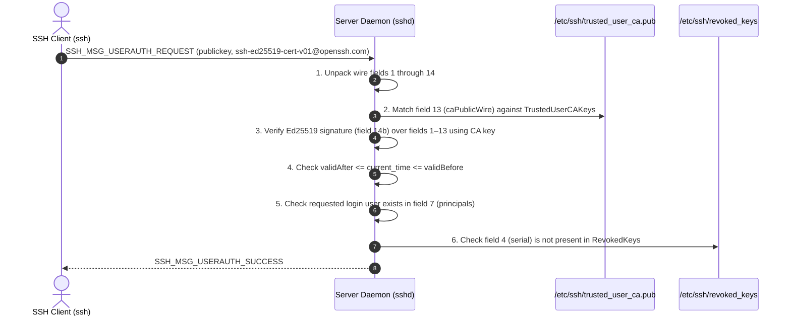

Muljax ID implements a native, zero-dependency OpenSSH certificate binary serialization and deserialization engine in `apps/api/src/lib/ssh/`. This document is an exhaustive engineering deep dive into the exact binary wire layout, endianness, cryptographic signing boundaries, and host verification pipelines conforming strictly to OpenSSH's certificate specification ([IETF draft-miller-ssh-cert](https://datatracker.ietf.org/doc/draft-miller-ssh-cert/)) and RFC 4251.

---

## 1. Governing Protocol Standards

The OpenSSH certificate implementation adheres strictly to three foundational standards:

1. **[RFC 4251](https://www.rfc-editor.org/rfc/rfc4251)**: *The Secure Shell (SSH) Protocol Architecture (§ 5: Data Type Representations)*. Defines the canonical network byte order, variable-length byte arrays, and string serialization formats.
2. **[OpenSSH Certificate Specification (IETF draft-miller-ssh-cert)](https://datatracker.ietf.org/doc/draft-miller-ssh-cert/)**: OpenSSH certificate format version 1 (`CERT01`), covering user/host key certificates, critical options, extensions, and signature wrappers (see also OpenSSH [`PROTOCOL`](https://github.com/openssh/openssh-portable/blob/master/PROTOCOL) § 1.3).
3. **[RFC 8032](https://www.rfc-editor.org/rfc/rfc8032)**: *Edwards-Curve Digital Signature Algorithm (Ed25519)*. Defines the pure Ed25519 signature algorithm and 32-byte point serialization used across all user keys and CA signatures.

---

## 2. Binary Wire Types & Endianness (RFC 4251 § 5)

All primitive data types are serialized in **network byte order (big-endian)**. The implementation in `apps/api/src/lib/ssh/wire.ts` uses contiguous `Uint8Array` allocations and `DataView` operations without any intermediate string conversions:

| Wire Type | Wire Size | Memory Representation | Implementation Detail (`SSHWriter`) |
| :--- | :--- | :--- | :--- |
| **`uint32`** | 4 bytes | 32-bit unsigned integer | `this.view.setUint32(this.offset, value, false)` |
| **`uint64`** | 8 bytes | 64-bit unsigned `bigint` | `this.view.setBigUint64(this.offset, value, false)` |
| **`string`** | 4 + `n` bytes | `uint32` length prefix followed by UTF-8 bytes | Prefixed length in bytes, followed by `TextEncoder.encode(str)` |
| **`bytes`** | 4 + `n` bytes | `uint32` length prefix followed by raw octets | Prefixed length in bytes, followed by `Uint8Array` payload |
| **`raw`** | `n` bytes | Raw unadorned octets | Direct slice copy without length prefix (used to embed pre-built buffers) |

```ts
// apps/api/src/lib/ssh/wire.ts
writeUint32(value: number): this {
    this.ensureCapacity(4);
    this.view.setUint32(this.offset, value, false); // false = big-endian
    this.offset += 4;
    return this;
}

writeUint64(value: bigint): this {
    this.ensureCapacity(8);
    this.view.setBigUint64(this.offset, value, false);
    this.offset += 8;
    return this;
}
```

---

## 3. Certificate Binary Wire Layout

For an Ed25519 user certificate (`ssh-ed25519-cert-v01@openssh.com`), the complete binary payload consists of two distinct segments:
1. **Pre-Signature Body (`toSign`)**: Fields 1 through 13 concatenated sequentially. This exact byte stream is passed to the cryptographic signing algorithm.
2. **Signature Block (`signature`)**: Field 14, an encapsulating byte wrapper containing the signature algorithm name and the raw 64-byte Ed25519 signature.

```mermaid
flowchart TD
    subgraph Certificate["OpenSSH Binary Certificate"]
        subgraph toSign["Pre-Signature Body (toSign) - Fields 1 through 13"]
            F1["1. certType (string)"]
            F2["2. nonce (bytes)"]
            F3["3. rawClientPublicKey (bytes)"]
            F4["4. serial (uint64)"]
            F5["5. type (uint32)"]
            F6["6. keyId (string)"]
            F7["7. principals (bytes blob)"]
            F8["8. validAfter (uint64)"]
            F9["9. validBefore (uint64)"]
            F10["10. criticalOptions (bytes blob)"]
            F11["11. extensions (bytes blob)"]
            F12["12. reserved (bytes blob)"]
            F13["13. caPublicWire (bytes blob)"]
        end
        subgraph sigBlock["Field 14: Signature Block (bytes)"]
            F14A["14a. sigAlgorithm (string)"]
            F14B["14b. rawSignature (bytes)"]
        end
        toSign -->|Signed by CA Ed25519 Key| sigBlock
    end
```



### Complete Field-by-Field Specification

| # | Field Name | Wire Type | Length (Bytes) | Exact Description & Code Representation |
| :- | :--- | :--- | :--- | :--- |
| **1** | `certType` | `string` | 4 + 35 = 39 | Constant `"ssh-ed25519-cert-v01@openssh.com"`. Defines the certificate key type. |
| **2** | `nonce` | `bytes` | 4 + 16 = 20 | 16 cryptographically secure random bytes generated via `crypto.getRandomValues(new Uint8Array(16))`. Prevents replay and duplicate signature collisions. |
| **3** | `pk` | `bytes` | 4 + 32 = 36 | The certified client's 32-byte raw Ed25519 public key. Extracted from the user's registered public key. |
| **4** | `serial` | `uint64` | 8 | Big-endian 64-bit monotonic unsigned integer. Generated via `BigInt(Date.now()) * 65536n + BigInt(randBytes[0] % 65536)`. |
| **5** | `type` | `uint32` | 4 | `1` for `SSH_CERT_TYPE_USER` (`2` for `SSH_CERT_TYPE_HOST`). Platform mints User certificates. |
| **6** | `keyId` | `string` | 4 + `k` | Human-readable identity string (e.g. `"alice@example.com"`). Logged by `sshd` upon server login. |
| **7** | `principals` | `bytes` | 4 + `p` | Length-prefixed wire buffer containing a sequence of `string` usernames (e.g. `alice`, `ubuntu`). |
| **8** | `validAfter` | `uint64` | 8 | UNIX epoch start timestamp in seconds. Set to `nowSeconds - 60n` (60-second backdate to tolerate client clock skew). |
| **9** | `validBefore` | `uint64` | 8 | UNIX epoch expiration timestamp in seconds. Set to `nowSeconds + BigInt(ttlSeconds)`. |
| **10** | `criticalOptions` | `bytes` | 4 + `c` | Length-prefixed wire buffer of name-value string pairs. Empty in standard user certificates (`0x00000000`). |
| **11** | `extensions` | `bytes` | 4 + `e` | Length-prefixed wire buffer of standard OpenSSH capability flags with empty value bytes. |
| **12** | `reserved` | `bytes` | 4 | Reserved for future protocol expansion. Always serialized as 4 zero bytes (`0x00000000`). |
| **13** | `caPublicWire` | `bytes` | 4 + 51 = 55 | Length-prefixed wire buffer containing the CA's public key: `string` `"ssh-ed25519"` (15 bytes) + `bytes` 32-byte raw CA public key (36 bytes). |
| **14** | `signature` | `bytes` | 4 + 83 = 87 | Length-prefixed signature envelope containing:<br/>• `sigAlgorithm`: `string` `"ssh-ed25519"` (15 bytes)<br/>• `rawSignature`: `bytes` 64-byte Ed25519 signature (68 bytes) |

---

## 4. Complex Field Serialization Mechanics

### Field 7: Principals Wire Buffer (`principals`)
The principals field is not a simple string; it is a **nested wire buffer** prefixed by an outer `uint32` byte count:

```ts
// apps/api/src/lib/ssh/certificate.ts
const principalsWriter = new SSHWriter();
for (const principal of data.principals) {
    principalsWriter.writeString(principal); // 4-byte len + UTF-8 bytes
}
writer.writeBytes(principalsWriter.toUint8Array()); // Outer 4-byte len + inner blob
```

If the certificate authorizes principals `["alice", "admin"]`:
- `principalsWriter` encodes:
  - `00 00 00 05` + `"alice"` (9 bytes)
  - `00 00 00 05` + `"admin"` (9 bytes)
  - Total inner bytes = 18 bytes.
- The outer certificate writer writes `00 00 00 12` (18 in hex) followed by the 18 bytes.

### Field 11: Extensions Wire Buffer (`extensions`)
OpenSSH extensions are structured as name/data pairs:
- **`name`**: `string` identifying the extension.
- **`data`**: `bytes` containing extension-specific data. For standard OpenSSH permission flags, this payload is **empty** (a `uint32` of 0).

Muljax ID mints certificates with the five standard interactive extensions enabled by default:
1. `permit-X11-forwarding`
2. `permit-agent-forwarding`
3. `permit-port-forwarding`
4. `permit-pty`
5. `permit-user-rc`

Each extension is written as:
```ts
extWriter.writeString(extName);              // 4-byte len + name UTF-8
extWriter.writeBytes(new Uint8Array(0));      // 4-byte len of 0 (0x00000000)
```

### Field 14: Signature Envelope
The signature is generated over the entire unadorned `toSign` buffer (Fields 1–13):

```ts
// 1. Sign the pre-signature payload
const signatureBuffer = await crypto.subtle.sign(
    { name: "Ed25519" },
    ca.privateKey,
    unsignedPayload
);
const rawSignature = new Uint8Array(signatureBuffer); // Exactly 64 bytes

// 2. Build the inner signature block
const sigBlockWriter = new SSHWriter();
sigBlockWriter.writeString("ssh-ed25519");            // 4 + 11 = 15 bytes
sigBlockWriter.writeBytes(rawSignature);              // 4 + 64 = 68 bytes
const sigBlock = sigBlockWriter.toUint8Array();        // Exactly 83 bytes

// 3. Append to the full wire certificate with outer length prefix
fullWriter.writeRaw(toSign);
fullWriter.writeBytes(sigBlock);                      // 4 bytes len (0x00000053) + 83 bytes
```

---

## 5. Serial Number Generation & Skew Invariants

### Monotonic Microsecond Serials
```text
Serial = (Date.now() * 65536) + (randBytes[0] % 65536)
```

```ts
const randBytes = new Uint32Array(1);
crypto.getRandomValues(randBytes);
serial = BigInt(Date.now()) * 65536n + BigInt(randBytes[0] % 65536);
```

**Benefits**:
- **Strict Monotonicity**: Certificates issued at later timestamps always have strictly higher serial numbers.
- **Uniqueness Under Concurrency**: Two certificates issued within the exact same millisecond have a `1 / 65536` collision probability, preventing sequence collisions on distributed edge workers.
- **Direct Revocation Indexing**: The 64-bit integer is stored directly as a indexed string in the `ssh_certificates.serial` table for instant lookups.

### Clock Skew Tolerance
To prevent certificates from being rejected due to minor time differences between Cloudflare edge workers and target Linux servers, `validAfter` is backdated by exactly 60 seconds:

```ts
const nowSeconds = BigInt(Math.floor(Date.now() / 1000));
const validAfter = nowSeconds - 60n; // 60s clock skew window
const validBefore = nowSeconds + BigInt(ttlSeconds);
```

---

## 6. Single-Line File Encoding

When exported for user workstations, the binary certificate byte stream is base64-encoded and formatted into the standard single-line string representation conforming to OpenSSH file conventions:

```text
ssh-ed25519-cert-v01@openssh.com AAAA...[base64-wire-bytes]... alice@example.com-cert
```

Implemented in `apps/api/src/lib/ssh/certificate.ts`:
```ts
export function formatOpenSshCertificate(
    certWireBytes: Uint8Array,
    comment?: string,
): string {
    const b64 = base64Encode(certWireBytes);
    return comment
        ? `${ED25519_CERT_KEY_TYPE} ${b64} ${comment}\n`
        : `${ED25519_CERT_KEY_TYPE} ${b64}\n`;
}
```

---

## 7. Target Host Verification Pipeline (`sshd`)

When an OpenSSH client connects to a server presenting an Ed25519 user certificate:



1. **Unpack Wire Fields**: `sshd` reads fields 1–14 using its internal `sshkey_from_blob` parser.
2. **CA Trust Verification**: `sshd` extracts field 13 (`caPublicWire`) and verifies that the key exists in `/etc/ssh/trusted_user_ca.pub` (configured via `TrustedUserCAKeys`).
3. **Cryptographic Signature Verification**: `sshd` computes `crypto_sign_ed25519_verify(sig, toSign, ca_pk)` over fields 1 through 13.
4. **Temporal Bounds Check**: Verifies that the host system's current time satisfies `validAfter <= now <= validBefore`.
5. **Principal Authorization**: Verifies that the username being authenticated matches at least one entry in the certificate's `principals` list.
6. **Revocation Check (KRL)**: If `RevokedKeys /etc/ssh/revoked_keys` is enabled in `sshd_config`, `sshd` extracts the certificate's 64-bit `serial` and confirms that it does not appear in the revocation list.

---

## 8. Key Revocation List (KRL) Wire Specification (PROTOCOL.krl)

OpenSSH's native binary KRL format provides maximum space efficiency when revoking certificates by serial number across host fleets. Muljax ID builds binary KRL payloads conforming directly to OpenSSH `PROTOCOL.krl` via `apps/api/src/lib/ssh/krl.ts`.

### KRL File Header Layout

| Field | Wire Type | Length (Bytes) | Description |
| :--- | :--- | :--- | :--- |
| `magic` | `uint64` | 8 | Constant `0x5353484b524c0a00ULL` (ASCII `"SSHKRL\n\0"`). |
| `format_version` | `uint32` | 4 | Fixed integer `1`. |
| `krl_version` | `uint64` | 8 | Monotonic version counter incremented upon list update. |
| `generated_date` | `uint64` | 8 | UNIX timestamp in seconds when the KRL was generated. |
| `flags` | `uint64` | 8 | Reserved bit flags (`0x0000000000000000`). |
| `reserved` | `string` | 4 | Length-prefixed string; empty in standard KRL (`0x00000000`). |
| `comment` | `string` | 4 + `c` | Optional UTF-8 descriptive comment. |

### Certificate Revocation Section (`KRL_SECTION_CERTIFICATES = 1`)

Following the 44-byte header, revoked certificates are grouped into certificate sections:

1. **`section_type` (`uint8`)**: Fixed byte `0x01` (`KRL_SECTION_CERTIFICATES`).
2. **`section_data` (`bytes blob`)**: Length-prefixed inner payload containing:
   - **`ca_key` (`string`)**: Wire-serialized CA public key (or empty string for wildcard CA matching).
   - **`reserved` (`string`)**: Empty wire string (`0x00000000`).
   - **Certificate Subsections**:
     - **`cert_section_type` (`uint8`)**: `0x20` (`KRL_SECTION_CERT_SERIAL_LIST`).
     - **`cert_section_data` (`bytes blob`)**: Sequence of 64-bit big-endian integers (`uint64 serial`) for each revoked certificate.

