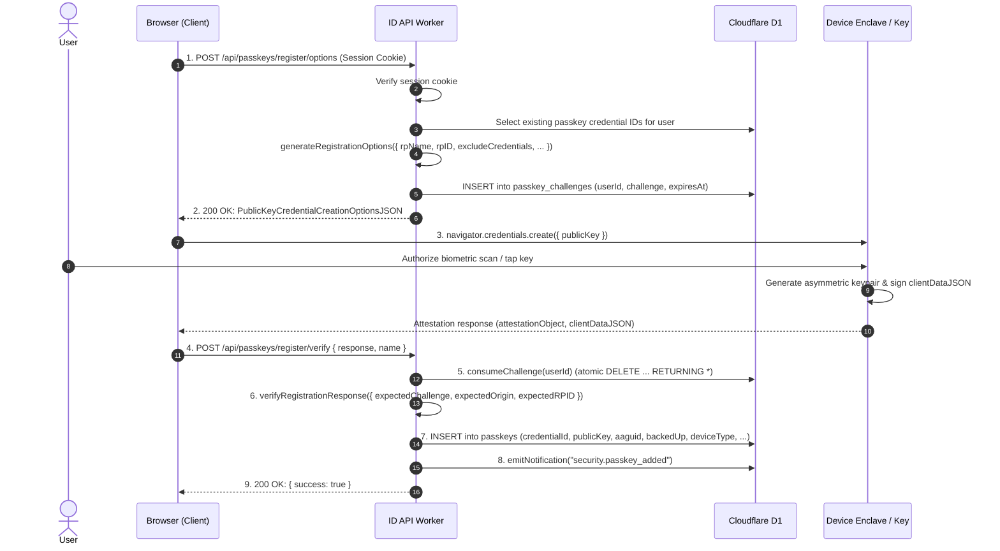
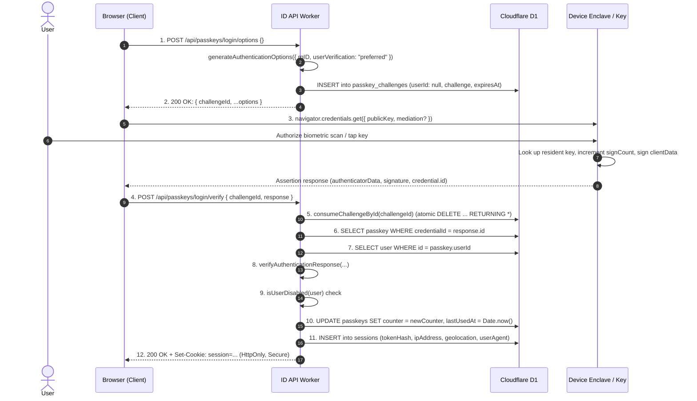

import { DatabaseTable, Callout, Badge } from '@/components/mdx';

Muljax ID implements a zero-trust, passwordless authentication subsystem adhering to the W3C Web Authentication (WebAuthn Level 3) and FIDO Alliance CTAP 2.1 specifications. It leverages hardware-bound cryptographic credentials, platform biometric authenticators (Touch ID, Windows Hello, Face ID), roaming hardware security keys (YubiKeys), and atomic challenge lifecycles in Cloudflare D1.

---

## 1. Governing Protocol Standards

The WebAuthn implementation operates across the following standards:

- **[W3C Web Authentication (WebAuthn Level 3)](https://www.w3.org/TR/webauthn-3/)**: Browser JavaScript APIs (`navigator.credentials.create` and `navigator.credentials.get`), server validation rules, and Conditional Mediation (Autofill UI).
- **[FIDO Alliance CTAP 2.1](https://fidoalliance.org/specs/fido-v2.1-ps-20210615/fido-client-to-authenticator-protocol-v2.1-ps-20210615.html)**: Client to Authenticator Protocol for communicating with USB, NFC, and Bluetooth authenticators, including Backup Eligibility (`BE`) and Backup State (`BS`) flags.
- **[RFC 8152](https://www.rfc-editor.org/rfc/rfc8152)**: *CBOR Object Signing and Encryption (COSE)*: Key representation format for public keys extracted from authenticators.
- **[RFC 4648](https://www.rfc-editor.org/rfc/rfc4648)**: Base64URL encoding used for binary credential IDs and cryptographic challenges.

---

## 2. Database Schema & Challenge Lifecycle

WebAuthn challenges are strictly ephemeral and single-use. The `passkey_challenges` table tracks active challenges with a hardcoded **5-minute TTL** (`CHALLENGE_DURATION = 5 * 60 * 1000`).

<DatabaseTable name="passkeys" />

<DatabaseTable name="passkey_challenges" />


### Atomic Challenge Consumption
To prevent race conditions and challenge replay attacks, challenges are consumed using SQLite's atomic `DELETE ... RETURNING *` in `apps/api/src/lib/passkey.ts`:

```ts
// Registration challenge consumption (scoped to authenticated user)
export async function consumeChallenge(db: ReturnType<typeof createDb>, userId: string) {
    const deleted = await db
        .delete(passkeyChallenges)
        .where(
            and(
                eq(passkeyChallenges.userId, userId),
                gt(passkeyChallenges.expiresAt, Date.now()),
            ),
        )
        .returning();
    return deleted[0] ?? null;
}

// Userless login challenge consumption (scoped by challenge UUID)
export async function consumeChallengeById(db: ReturnType<typeof createDb>, id: string) {
    const deleted = await db
        .delete(passkeyChallenges)
        .where(
            and(
                eq(passkeyChallenges.id, id),
                isNull(passkeyChallenges.userId),
                gt(passkeyChallenges.expiresAt, Date.now()),
            ),
        )
        .returning();
    return deleted[0] ?? null;
}
```

Because the row is deleted in the exact same query that retrieves it, a challenge can **never** be used more than once, even under concurrent requests.

---

## 3. Registration Ceremony (Attestation)

Registration binds a new public/private keypair inside the user's authenticator to their account.



### Server Options Generation (`POST /api/passkeys/register/options`)
In `apps/api/src/routes/passkeys/register/options/post.ts`:

```ts
const existingPasskeys = await db
    .select({ credentialId: passkeys.credentialId })
    .from(passkeys)
    .where(eq(passkeys.userId, user.id));

const options = await generateRegistrationOptions({
    rpName: c.env.RP_NAME,
    rpID: c.env.RP_ID,
    userName: user.email,
    userDisplayName: user.email,
    excludeCredentials: existingPasskeys.map(({ credentialId }) => ({
        id: credentialId,
    })),
    authenticatorSelection: {
        residentKey: "required",       // Enforces discoverable credentials for userless login
        userVerification: "preferred", // Requests biometric verification when available
    },
    attestationType: "none",          // Eliminates unnecessary privacy-invasive tracking
});

await createChallenge(db, user.id, options.challenge);
```

### Server Verification (`POST /api/passkeys/register/verify`)
In `apps/api/src/routes/passkeys/register/verify/post.ts`:
1. Atomically consumes the challenge from `passkey_challenges`.
2. Validates origin matches `getDashboardOrigin(c.env)` and RP ID matches `c.env.RP_ID`.
3. Verifies cryptographic signature in `attestationObject`.
4. Enforces uniqueness: checks that `credential.id` is not already registered (`409 Conflict`).
5. Extracts FIDO2 device metadata:
   - `aaguid`: Authenticator Attestation GUID identifying the manufacturer/model.
   - `backedUp`: Credential backup state (`credentialBackedUp` flag).
   - `deviceType`: Device sync classification (`'singleDevice'` vs `'multiDevice'`).
6. Persists the credential in `passkeys`:
   - `id`: UUID v4
   - `credentialId`: Base64URL credential string
   - `publicKey`: Base64 encoded public key bytes (`arrayBufferToBase64(credential.publicKey)`)
   - `counter`: Initial integer sign count
   - `transports`: JSON array of supported transports (e.g. `["internal"]` or `["usb", "nfc"]`)
   - `aaguid`, `backedUp`, `deviceType`: Authenticator classification metadata

---

## 4. Authentication Ceremony (Assertion)

The platform supports both **Browser-Native Autofill (Conditional UI)** and **Modal Discoverable Credential Login**: the user does not need to type their email or username. The authenticator looks up the resident key matching the RP ID and returns the credential identifier.

### Conditional UI (Autofill) Mediation

When a supported browser navigates to `/login`, the frontend initiates a background assertion request with `mediation: "conditional"` attached to the username input element (`autoComplete="username webauthn"`):

```ts
if (
    typeof window !== "undefined" &&
    window.PublicKeyCredential &&
    await PublicKeyCredential.isConditionalMediationAvailable?.()
) {
    const options = await api.post("/api/passkeys/login/options", {});
    const credential = await navigator.credentials.get({
        publicKey: options,
        mediation: "conditional",
    });
    await api.post("/api/passkeys/login/verify", {
        challengeId: options.challengeId,
        response: credential,
    });
}
```



### Assertion Verification Invariants (`POST /api/passkeys/login/verify`)
In `apps/api/src/routes/passkeys/login/verify/post.ts`:

1. **Challenge Validity**: Verifies that `challengeId` exists and is consumed atomically.
2. **Credential Lookup**: Locates the public key bytes stored in `passkeys.publicKey`.
3. **Cryptographic Signature Verification**: Validates the signature over `authenticatorData` and SHA-256 hash of `clientDataJSON`.
4. **Origin Binding**: Rejects the assertion if the origin in `clientDataJSON` does not match the configured dashboard domain.
5. **Account Status Guard**:
   ```ts
   if (isUserDisabled(user)) {
       return c.json({ error: "Your account has been disabled." }, 403);
   }
   ```
6. **Sign Counter Monotonicity**: Checks that `newCounter > storedCounter` to detect cloned authenticators.
7. **Session Issuance**: Generates a cryptographically random session token, hashes it with SHA-256 before inserting into `sessions`, records Cloudflare edge geolocation metadata (`cf.country`, `cf.city`, `cf.region`), and sets the HttpOnly cookie.

---

## 5. WebAuthn Binary Data Layouts

### `clientDataJSON`
UTF-8 JSON string created by the browser and hashed by the authenticator:

```json
{
  "type": "webauthn.get",
  "challenge": "dGVzdC1jaGFsbGVuZ2UtMTIzNDU2",
  "origin": "https://id.example.com",
  "crossOrigin": false
}
```

### `authenticatorData` Binary Layout (CTAP 2.1 § 6)

The binary `authenticatorData` buffer returned by the authenticator is structured as follows:

| Byte Offset | Length | Name | Description |
| :--- | :--- | :--- | :--- |
| `0` | 32 bytes | `rpIdHash` | SHA-256 hash of the Relying Party ID string (`c.env.RP_ID`). |
| `32` | 1 byte | `flags` | Bitfield representing authenticator execution flags (see below). |
| `33` | 4 bytes | `signCount` | 32-bit unsigned big-endian integer incremented on each signature. |
| `37` | `k` bytes | `attestedCredentialData` | *(Registration only)* Contains AAGUID (16 bytes), Credential ID length (2 bytes), Credential ID (`n` bytes), and COSE Public Key. |

#### Flags Bitfield Breakdown (`flags`)
- **Bit 0 (`UP`)**: **User Present**. Set if physical presence was verified (e.g. key tap).
- **Bit 2 (`UV`)**: **User Verified**. Set if biometric or PIN verification succeeded.
- **Bit 3 (`BE`)**: **Backup Eligibility**. Set if the authenticator is capable of backing up this credential.
- **Bit 4 (`BS`)**: **Backup State**. Set if the credential is currently backed up to a multi-device synced cloud (e.g. iCloud Keychain).
- **Bit 6 (`AT`)**: **Attested Credential Data**. Indicates whether credential public key data is appended.
- **Bit 7 (`ED`)**: **Extension Data**. Indicates whether authenticator extension data is appended.

---

## 6. Passkey Management & Endpoint Security

### Renaming Passkeys (`PATCH /api/passkeys/{id}`)

Users can update the friendly label of any registered authenticator. The endpoint validates ownership to ensure credentials can only be renamed by their creator:

```ts
// apps/api/src/routes/passkeys/id/patch.ts
await db
    .update(passkeys)
    .set({ name: body.name })
    .where(and(eq(passkeys.id, id), eq(passkeys.userId, user.id)));
```

### Strict Sensitive Route Caching Policy

All WebAuthn challenge creation and verification routes strictly emit no-cache headers:

```http
Cache-Control: no-store, no-cache, must-revalidate, max-age=0
Pragma: no-cache
```

This prevents edge proxies, intermediate caches, or browsers from retaining single-use cryptographic challenges or assertion payloads.

---

## 7. Threat Model & Defense Mechanisms

| Threat | Attack Vector | Mitigation in Muljax ID |
| :--- | :--- | :--- |
| **Phishing / Credential Harvesting** | Attacker lures user to fake domain (e.g. `id-login.com`). | Authenticators bind signatures strictly to the TLS origin. The browser refuses to sign for incorrect domains. |
| **Replay Attacks** | Eavesdropper captures previous assertion payload and re-sends. | Challenges expire after 5 minutes and are consumed atomically via `DELETE ... RETURNING *`. |
| **Cloned Authenticators** | Private key extracted or cloned from physical device. | Monotonic sign counter validation detects duplicate counter values and immediately flags clone activity. |
| **Database Compromise** | Attacker obtains full read dump of Cloudflare D1. | Zero private keys exist in the database. Only public keys and credential IDs are stored. Sessions and tokens are stored as SHA-256 hashes. |
| **Bypassing Disabled Accounts** | Suspended user attempts to authenticate with a valid passkey. | API checks `isUserDisabled(user)` immediately after cryptographic verification and rejects with `403 Forbidden` before creating a session. |
| **Cache Poisoning / Challenge Reuse** | CDN or proxy serves a cached challenge options response. | `Cache-Control: no-store` explicitly configured across all passkey options and verification routes. |
