Muljax ID utilizes [Cloudflare D1](https://developers.cloudflare.com/d1/) (distributed edge SQLite) managed via [Drizzle ORM](https://orm.drizzle.team). Foreign key constraints and cascading deletes (`ON DELETE CASCADE`) are strictly enabled across all relational boundaries.

---

## Entity Relationship Overview

```mermaid
erDiagram
    users ||--o{ sessions : "has active"
    users ||--o{ passkeys : "enrolled"
    users ||--o{ user_ssh_keys : "registers"
    users ||--o{ ssh_certificates : "issued to"
    users ||--o{ user_roles : "assigned"
    roles ||--o{ user_roles : "granted to"
    roles ||--o{ role_permissions : "contains"
    permissions ||--o{ role_permissions : "assigned to"
    users ||--o{ oauth_authorization_codes : "authorizes"
    oauth_clients ||--o{ oauth_authorization_codes : "issued for"
    users ||--o{ oauth_access_tokens : "owns"
    oauth_clients ||--o{ oauth_access_tokens : "issued to"
    users ||--o{ oauth_refresh_tokens : "owns"
    oauth_clients ||--o{ oauth_refresh_tokens : "issued to"
    users ||--o{ oauth_grants : "grants consent"
    oauth_clients ||--o{ oauth_grants : "consented client"
    users ||--o{ lifecycle_actions : "targets"
    users ||--o{ notifications : "receives"
    users ||--o{ password_reset_tokens : "requests"
    users ||--o{ invite_tokens : "creates / consumes"
    roles ||--o{ invite_tokens : "assigns on signup"
    users ||--o{ signin_keys : "provisions"
```

---

## 1. Identity & Sessions

### `users` (`apps/api/src/db/schema/users.ts`)
Core identity record storing normalized profile claims, authentication hashes, and suspension status.

| Column | SQL Type | Modifiers | Description |
| :--- | :--- | :--- | :--- |
| `id` | `text` | `PRIMARY KEY` | Unique subject identifier (UUID or CUID). |
| `email` | `text` | `NOT NULL, UNIQUE` | Primary user email address used for login. |
| `password_hash` | `text` | `NOT NULL` | Cryptographic password hash (Scrypt / Argon2 with salt). |
| `display_name` | `text` | `NULL` | Full preferred display name (OIDC `name`). |
| `given_name` | `text` | `NULL` | First name (OIDC `given_name`). |
| `family_name` | `text` | `NULL` | Last name (OIDC `family_name`). |
| `middle_name` | `text` | `NULL` | Middle name (OIDC `middle_name`). |
| `nickname` | `text` | `NULL` | Casual nickname. |
| `preferred_username` | `text` | `UNIQUE, NULL` | POSIX username used as default SSH certificate principal. |
| `profile_url` | `text` | `NULL` | Personal homepage or profile link. |
| `profile_image_key` | `text` | `NULL` | Object storage key in Cloudflare R2 for custom profile avatar. |
| `website` | `text` | `NULL` | User website URL. |
| `gender` | `text` | `NULL` | Gender claim. |
| `birthdate` | `text` | `NULL` | Birthdate string (`YYYY-MM-DD`). |
| `zoneinfo` | `text` | `NULL` | Timezone string (e.g. `America/Chicago`). |
| `locale` | `text` | `NULL` | Language/locale identifier (e.g. `en-US`). |
| `email_verified_at` | `integer` | `NULL` | Verification timestamp (epoch ms). |
| `disabled_at` | `integer` | `NULL` | Suspension timestamp (epoch ms). If non-null, user is blocked. |
| `created_at` | `integer` | `NOT NULL` | Account creation timestamp (epoch ms). |
| `updated_at` | `integer` | `NOT NULL` | Last attribute update timestamp (epoch ms). |

### `sessions` (`apps/api/src/db/schema/sessions.ts`)
Active authenticated browser sessions with edge geolocation telemetry.

| Column | SQL Type | Modifiers | Description |
| :--- | :--- | :--- | :--- |
| `id` | `text` | `PRIMARY KEY` | Session record identifier (UUID). |
| `user_id` | `text` | `NOT NULL, FK -> users(id) ON DELETE CASCADE` | Associated user account. |
| `token_hash` | `text` | `NOT NULL, UNIQUE` | SHA-256 digest of the cookie session secret. |
| `ip_address` | `text` | `NULL` | Client IP address (`CF-Connecting-IP`). |
| `country` | `text` | `NULL` | Country code from Cloudflare edge header (`cf.country`). |
| `city` | `text` | `NULL` | City from Cloudflare edge header (`cf.city`). |
| `region` | `text` | `NULL` | Sub-national region/state (`cf.region`). |
| `user_agent` | `text` | `NULL` | Client `User-Agent` HTTP header. |
| `browser` | `text` | `NULL` | Parsed browser family and version. |
| `os` | `text` | `NULL` | Parsed operating system name and version. |
| `expires_at` | `integer` | `NOT NULL` | Session expiry timestamp (epoch ms). |
| `created_at` | `integer` | `NOT NULL` | Creation timestamp (epoch ms). |
| `last_used_at` | `integer` | `NULL` | Updated on each authenticated request to detect dormant sessions. |

### `password_reset_tokens` (`apps/api/src/db/schema/password-reset.ts`)
Ephemeral single-use password recovery tokens.

| Column | SQL Type | Modifiers | Description |
| :--- | :--- | :--- | :--- |
| `id` | `text` | `PRIMARY KEY` | Token record UUID. |
| `user_id` | `text` | `NOT NULL, FK -> users(id) ON DELETE CASCADE` | Target user account. |
| `token_hash` | `text` | `NOT NULL, UNIQUE` | SHA-256 digest of the secret reset token. |
| `expires_at` | `integer` | `NOT NULL` | Expiration timestamp (epoch ms). |
| `created_at` | `integer` | `NOT NULL` | Emission timestamp (epoch ms). |

---

## 2. WebAuthn & Passkeys

### `passkeys` (`apps/api/src/db/schema/passkeys.ts`)
Enrolled FIDO2 / WebAuthn resident and roaming credentials.

| Column | SQL Type | Modifiers | Description |
| :--- | :--- | :--- | :--- |
| `id` | `text` | `PRIMARY KEY` | Record UUID. |
| `user_id` | `text` | `NOT NULL, FK -> users(id) ON DELETE CASCADE` | Associated user account. |
| `credential_id` | `text` | `NOT NULL, UNIQUE` | Base64URL-encoded credential identifier generated by authenticator. |
| `public_key` | `text` | `NOT NULL` | Base64-encoded raw public key bytes. |
| `counter` | `integer` | `NOT NULL, DEFAULT 0` | Monotonic signature counter for clone detection. |
| `transports` | `text` | `NULL` | JSON array of supported transports (e.g. `["internal", "usb"]`). |
| `name` | `text` | `NULL` | User-defined label (e.g. `"MacBook Pro Touch ID"`). |
| `created_at` | `integer` | `NOT NULL` | Enrollment timestamp (epoch ms). |
| `last_used_at` | `integer` | `NULL` | Timestamp of most recent successful assertion. |

### `passkey_challenges` (`apps/api/src/db/schema/passkeyChallenges.ts`)
Transient challenges with single-use atomic consumption via `DELETE ... RETURNING *`.

| Column | SQL Type | Modifiers | Description |
| :--- | :--- | :--- | :--- |
| `id` | `text` | `PRIMARY KEY` | Challenge record UUID. |
| `user_id` | `text` | `NULL` | Bound user ID for registration; `NULL` for userless login. |
| `challenge` | `text` | `NOT NULL` | 32-byte cryptographic challenge string. |
| `expires_at` | `integer` | `NOT NULL` | Expiration timestamp (epoch ms, 5-minute TTL). |
| `created_at` | `integer` | `NOT NULL` | Creation timestamp (epoch ms). |

---

## 3. SSH Certificate Authority

### `user_ssh_keys` (`apps/api/src/db/schema/ssh.ts`)
Registered user public keys used as certificate signing subjects.

| Column | SQL Type | Modifiers | Description |
| :--- | :--- | :--- | :--- |
| `id` | `text` | `PRIMARY KEY` | Key record UUID. |
| `user_id` | `text` | `NOT NULL, FK -> users(id) ON DELETE CASCADE` | Associated user account. |
| `name` | `text` | `NOT NULL` | User-provided key label (e.g. `"Work Laptop M3"`). |
| `public_key` | `text` | `NOT NULL` | OpenSSH public key line (`ssh-ed25519 AAAAC3...`). |
| `fingerprint` | `text` | `NOT NULL` | SHA-256 fingerprint (`SHA256:...`). |
| `created_at` | `integer` | `NOT NULL` | Registration timestamp (epoch ms). |
| `last_used_at` | `integer` | `NULL` | Timestamp when a certificate was last minted for this key. |

**Indices**:
- `user_ssh_keys_user_idx` on `(user_id)`
- `user_ssh_keys_fingerprint_idx` on `(fingerprint)`

### `ssh_certificates` (`apps/api/src/db/schema/ssh.ts`)
Comprehensive audit ledger of all issued OpenSSH certificates.

| Column | SQL Type | Modifiers | Description |
| :--- | :--- | :--- | :--- |
| `id` | `text` | `PRIMARY KEY` | Record UUID. |
| `user_id` | `text` | `NOT NULL, FK -> users(id) ON DELETE CASCADE` | Certificate recipient. |
| `serial` | `text` | `NOT NULL` | 64-bit monotonic serial number string. |
| `key_id` | `text` | `NOT NULL` | Embedded identity string (user email). |
| `principals` | `text` | `NOT NULL` | JSON array of authorized UNIX usernames. |
| `valid_after` | `integer` | `NOT NULL` | Validity start timestamp (UNIX epoch seconds). |
| `valid_before` | `integer` | `NOT NULL` | Validity expiration timestamp (UNIX epoch seconds). |
| `fingerprint` | `text` | `NOT NULL` | Certified user public key SHA-256 fingerprint. |
| `ca_fingerprint` | `text` | `NOT NULL` | Signing CA public key SHA-256 fingerprint. |
| `client_ip` | `text` | `NULL` | Requester client IP address. |
| `user_agent` | `text` | `NULL` | Requester `User-Agent`. |
| `revoked_at` | `integer` | `NULL` | Revocation timestamp if revoked (epoch seconds). |
| `revoked_by` | `text` | `NULL` | Admin user ID who executed revocation. |
| `revoked_reason` | `text` | `NULL` | Explicit audit reason for revocation. |
| `created_at` | `integer` | `NOT NULL` | Issuance timestamp (epoch ms). |

**Indices**:
- `ssh_certificates_user_idx` on `(user_id)`
- `ssh_certificates_serial_idx` on `(serial)`
- `ssh_certificates_fingerprint_idx` on `(fingerprint)`

---

## 4. Role-Based Access Control (RBAC)

> **Standard Seeding**: D1 is pre-seeded on deployment with system permissions (`SYSTEM_PERMISSIONS`), default roles (`admin`, `user`, `everyone`), and their baseline associations (`role_permissions`) via `scripts/seed-d1.ts`.

### `roles` (`apps/api/src/db/schema/rbac.ts`)

| Column | SQL Type | Modifiers | Description |
| :--- | :--- | :--- | :--- |
| `id` | `text` | `PRIMARY KEY` | Role slug (`admin`, `user`, `everyone`, or custom). |
| `name` | `text` | `NOT NULL, UNIQUE` | Human-readable role title. |
| `description` | `text` | `NULL` | Purpose and scope of the role. |
| `is_system` | `integer` (boolean) | `NOT NULL, DEFAULT false` | If true, role is protected and cannot be deleted. |
| `created_at` | `integer` | `NOT NULL` | Creation timestamp (epoch ms). |
| `updated_at` | `integer` | `NOT NULL` | Modification timestamp (epoch ms). |

### `permissions` (`apps/api/src/db/schema/rbac.ts`)

| Column | SQL Type | Modifiers | Description |
| :--- | :--- | :--- | :--- |
| `id` | `text` | `PRIMARY KEY` | Permission identifier (`resource:action`, e.g. `users:read`). |
| `name` | `text` | `NOT NULL` | Human-readable permission name. |
| `description` | `text` | `NULL` | Detailed explanation of access rights. |
| `resource` | `text` | `NOT NULL` | Parent resource group (e.g. `users`, `ssh`, `roles`). |
| `is_system` | `integer` (boolean) | `NOT NULL, DEFAULT true` | System-defined permission. |
| `created_at` | `integer` | `NOT NULL` | Creation timestamp (epoch ms). |
| `updated_at` | `integer` | `NOT NULL` | Modification timestamp (epoch ms). |

### `role_permissions` (`apps/api/src/db/schema/rbac.ts`)
Composite primary key join table linking permissions to roles.

| Column | SQL Type | Modifiers | Description |
| :--- | :--- | :--- | :--- |
| `role_id` | `text` | `NOT NULL, FK -> roles(id) ON DELETE CASCADE` | Role slug. |
| `permission_id` | `text` | `NOT NULL, FK -> permissions(id) ON DELETE CASCADE` | Permission identifier. |
| `created_at` | `integer` | `NOT NULL` | Assignment timestamp (epoch ms). |

**Primary Key**: `(role_id, permission_id)`
**Index**: `role_permissions_permission_idx` on `(permission_id)`

### `user_roles` (`apps/api/src/db/schema/rbac.ts`)
Composite primary key join table linking roles to users.

| Column | SQL Type | Modifiers | Description |
| :--- | :--- | :--- | :--- |
| `user_id` | `text` | `NOT NULL, FK -> users(id) ON DELETE CASCADE` | User account ID. |
| `role_id` | `text` | `NOT NULL, FK -> roles(id) ON DELETE CASCADE` | Role slug. |
| `assigned_at` | `integer` | `NOT NULL` | Assignment timestamp (epoch ms). |
| `assigned_by` | `text` | `NULL, FK -> users(id) ON DELETE SET NULL` | Administrator who assigned role. |

**Primary Key**: `(user_id, role_id)`
**Index**: `user_roles_role_idx` on `(role_id)`

---

## 5. OAuth 2.0 & OIDC

> **Standard Seeding**: D1 is pre-seeded on deployment with the official `muljax-cli` public OAuth client (configured with RFC 8252 loopback callbacks and SSH/OIDC scopes) via `scripts/seed-d1.ts`.

### `oauth_clients` (`apps/api/src/db/schema/oauth.ts`)

| Column | SQL Type | Modifiers | Description |
| :--- | :--- | :--- | :--- |
| `id` | `text` | `PRIMARY KEY` | Permanent OAuth `client_id`. |
| `name` | `text` | `NOT NULL` | Application name shown on consent screen. |
| `client_type` | `text` | `NOT NULL` | `'public'` (SPA/mobile) or `'confidential'` (backend web app). |
| `client_secret_hash` | `text` | `NULL` | SHA-256 digest of secret (confidential clients only). |
| `redirect_uris` | `text` | `NOT NULL` | JSON array of authorized callback URLs. |
| `scopes` | `text` | `NOT NULL` | JSON array of permitted scopes (`openid`, `profile`, `email`, `offline_access`). |
| `created_at` | `integer` | `NOT NULL` | Creation timestamp (epoch ms). |
| `updated_at` | `integer` | `NOT NULL` | Modification timestamp (epoch ms). |

### `oauth_authorization_codes` (`apps/api/src/db/schema/oauth.ts`)
Single-use ephemeral codes with 10-minute validity.

| Column | SQL Type | Modifiers | Description |
| :--- | :--- | :--- | :--- |
| `id` | `text` | `PRIMARY KEY` | Code record UUID. |
| `client_id` | `text` | `NOT NULL, FK -> oauth_clients(id) ON DELETE CASCADE` | Requesting client. |
| `user_id` | `text` | `NOT NULL, FK -> users(id) ON DELETE CASCADE` | Consenting user. |
| `code_hash` | `text` | `NOT NULL, UNIQUE` | SHA-256 digest of the authorization code. |
| `redirect_uri` | `text` | `NOT NULL` | Exact redirect URI supplied during authorization. |
| `scope` | `text` | `NOT NULL` | Granted scope space-delimited string. |
| `nonce` | `text` | `NULL` | OIDC client nonce forwarded to ID token. |
| `code_challenge` | `text` | `NULL` | PKCE SHA-256 code challenge. |
| `code_challenge_method` | `text` | `NULL` | Strictly `'S256'`. |
| `acr` | `text` | `NULL` | Authentication Context Class Reference. |
| `auth_time` | `integer` | `NULL` | User authentication timestamp. |
| `expires_at` | `integer` | `NOT NULL` | Expiration timestamp (epoch ms, 10 min TTL). |
| `created_at` | `integer` | `NOT NULL` | Generation timestamp (epoch ms). |
| `used_at` | `integer` | `NULL` | Timestamp when exchanged; prevents code reuse. |

### `oauth_access_tokens` (`apps/api/src/db/schema/oauth.ts`)

| Column | SQL Type | Modifiers | Description |
| :--- | :--- | :--- | :--- |
| `id` | `text` | `PRIMARY KEY` | Token record UUID. |
| `client_id` | `text` | `NOT NULL, FK -> oauth_clients(id) ON DELETE CASCADE` | Bound client. |
| `user_id` | `text` | `NULL, FK -> users(id) ON DELETE CASCADE` | Bound user (`NULL` for client credentials). |
| `token_hash` | `text` | `NOT NULL, UNIQUE` | SHA-256 digest of bearer access token (`at_...`). |
| `scope` | `text` | `NOT NULL` | Authorized scope string. |
| `expires_at` | `integer` | `NOT NULL` | Expiry timestamp (epoch ms, 1 hour TTL). |
| `created_at` | `integer` | `NOT NULL` | Issuance timestamp (epoch ms). |

### `oauth_refresh_tokens` (`apps/api/src/db/schema/oauth.ts`)

| Column | SQL Type | Modifiers | Description |
| :--- | :--- | :--- | :--- |
| `id` | `text` | `PRIMARY KEY` | Refresh token record UUID. |
| `client_id` | `text` | `NOT NULL, FK -> oauth_clients(id) ON DELETE CASCADE` | Bound client. |
| `user_id` | `text` | `NOT NULL, FK -> users(id) ON DELETE CASCADE` | Bound user. |
| `token_hash` | `text` | `NOT NULL, UNIQUE` | SHA-256 digest of refresh token (`rt_...`). |
| `scope` | `text` | `NOT NULL` | Authorized scope string. |
| `expires_at` | `integer` | `NOT NULL` | Expiry timestamp (epoch ms, 30 days TTL). |
| `created_at` | `integer` | `NOT NULL` | Issuance timestamp (epoch ms). |
| `revoked_at` | `integer` | `NULL` | Revocation timestamp if invalidated. |
| `replaced_by` | `text` | `NULL` | Subsequent refresh token if rotated. |

### `oauth_grants` (`apps/api/src/db/schema/oauth.ts`)
User consent records mapping authorizations.

| Column | SQL Type | Modifiers | Description |
| :--- | :--- | :--- | :--- |
| `id` | `text` | `PRIMARY KEY` | Grant UUID. |
| `user_id` | `text` | `NOT NULL, FK -> users(id) ON DELETE CASCADE` | Consenting user. |
| `client_id` | `text` | `NOT NULL, FK -> oauth_clients(id) ON DELETE CASCADE` | Authorized client. |
| `scopes` | `text` | `NOT NULL` | JSON array of approved scopes. |
| `created_at` | `integer` | `NOT NULL` | Consent timestamp (epoch ms). |
| `updated_at` | `integer` | `NOT NULL` | Last scope update timestamp. |

---

## 6. Durable Workflows, Notifications & Settings

### `lifecycle_actions` (`apps/api/src/db/schema/lifecycle.ts`)
Queued asynchronous background jobs executed by Cloudflare Workflows.

| Column | SQL Type | Modifiers | Description |
| :--- | :--- | :--- | :--- |
| `id` | `text` | `PRIMARY KEY` | Workflow job UUID. |
| `user_id` | `text` | `NOT NULL, FK -> users(id) ON DELETE CASCADE` | Target user account. |
| `action` | `text` | `NOT NULL` | `'enable'` or `'disable'`. |
| `execute_at` | `integer` | `NOT NULL` | Scheduled execution timestamp (epoch ms). |
| `status` | `text` | `NOT NULL, DEFAULT 'pending'` | Status (`pending`, `running`, `completed`, `failed`, `cancelled`). |
| `created_at` | `integer` | `NOT NULL` | Queue timestamp (epoch ms). |
| `updated_at` | `integer` | `NOT NULL` | Status update timestamp (epoch ms). |
| `executed_at` | `integer` | `NULL` | Execution completion timestamp. |
| `cancelled_at` | `integer` | `NULL` | Cancellation timestamp. |
| `error` | `text` | `NULL` | Failure diagnostic message. |

**Indices**:
- `lifecycle_actions_pending_idx` on `(status, execute_at)`
- `lifecycle_actions_user_idx` on `(user_id)`

### `notifications` (`apps/api/src/db/schema/notifications.ts`)
Persistent event log backing real-time SSE event streams.

| Column | SQL Type | Modifiers | Description |
| :--- | :--- | :--- | :--- |
| `id` | `text` | `PRIMARY KEY` | Notification UUID. |
| `target` | `text` | `NOT NULL, DEFAULT 'user'` | Delivery audience: `'user'`, `'admins'`, or `'all'`. |
| `user_id` | `text` | `NULL, FK -> users(id) ON DELETE CASCADE` | Target user if audience is `'user'`. |
| `type` | `text` | `NOT NULL` | Event type slug (e.g. `security.passkey_added`, `user.disabled`). |
| `category` | `text` | `NOT NULL, DEFAULT 'general'` | Category: `security`, `auth`, `admin`, `general`, `system`. |
| `severity` | `text` | `NOT NULL, DEFAULT 'info'` | Severity: `info`, `success`, `warning`, `danger`. |
| `title` | `text` | `NOT NULL` | Short notification title. |
| `message` | `text` | `NOT NULL` | Detailed notification description. |
| `action_url` | `text` | `NULL` | Relative dashboard navigation route. |
| `data` | `text` | `NULL` | JSON-encoded contextual payload. |
| `read_at` | `integer` | `NULL` | Timestamp when marked read by recipient. |
| `created_at` | `integer` | `NOT NULL` | Emission timestamp (epoch ms). |

### `instance_settings` (`apps/api/src/db/schema/instanceSettings.ts`)
Tenant policy and registration gates.

| Column | SQL Type | Modifiers | Description |
| :--- | :--- | :--- | :--- |
| `id` | `integer` | `PRIMARY KEY` | Singleton settings row ID. |
| `signup_mode` | `text` | `NOT NULL, DEFAULT 'enabled'` | Registration policy: `'enabled'`, `'invite'`, or `'disabled'`. |
| `signin_mode` | `text` | `NOT NULL, DEFAULT 'enabled'` | Authentication policy: `'enabled'`, `'admin_key'`, or `'disabled'`. |
| `created_at` | `integer` | `NOT NULL` | Initialization timestamp (epoch ms). |
| `updated_at` | `integer` | `NOT NULL` | Configuration update timestamp (epoch ms). |

### `invite_tokens` (`apps/api/src/db/schema/invites.ts`)
Single-use onboarding tokens used for account creation when signup mode is `invite` or for targeted role onboarding.

| Column | SQL Type | Modifiers | Description |
| :--- | :--- | :--- | :--- |
| `id` | `text` | `PRIMARY KEY` | Invite token record UUID. |
| `email` | `text` | `NULL` | Optional email restriction. If specified, only this address can consume the token. |
| `token_hash` | `text` | `NOT NULL, UNIQUE` | SHA-256 digest of the raw invite token. |
| `role_id` | `text` | `NOT NULL, DEFAULT 'user', FK -> roles(id) ON DELETE CASCADE` | Role automatically granted upon registration. |
| `created_by_user_id` | `text` | `NULL, FK -> users(id) ON DELETE SET NULL` | Admin who generated the invite. |
| `used_by_user_id` | `text` | `NULL, FK -> users(id) ON DELETE SET NULL` | User who redeemed the token. |
| `expires_at` | `integer` | `NOT NULL` | Expiration timestamp (epoch ms). |
| `used_at` | `integer` | `NULL` | Consumption timestamp (epoch ms). |
| `created_at` | `integer` | `NOT NULL` | Creation timestamp (epoch ms). |

**Indices**:
- `invite_tokens_token_hash_idx` on `(token_hash)`
- `invite_tokens_email_idx` on `(email)`

### `signin_keys` (`apps/api/src/db/schema/signinKeys.ts`)
Break-glass administrative access keys for instance emergency authentication during `admin_key` signin mode.

| Column | SQL Type | Modifiers | Description |
| :--- | :--- | :--- | :--- |
| `id` | `text` | `PRIMARY KEY` | Access key record UUID. |
| `name` | `text` | `NOT NULL` | Human-readable key label (e.g. `"Emergency Access Key"`). |
| `key_hash` | `text` | `NOT NULL, UNIQUE` | SHA-256 digest of the raw key string. |
| `key_prefix` | `text` | `NOT NULL` | Identification prefix shown in UI (e.g. `id_key_ab12`). |
| `created_by_user_id` | `text` | `NULL, FK -> users(id) ON DELETE SET NULL` | Admin who provisioned the key. |
| `expires_at` | `integer` | `NULL` | Expiration timestamp (epoch ms), or `NULL` if no expiration. |
| `last_used_at` | `integer` | `NULL` | Timestamp of most recent authentication assertion (epoch ms). |
| `created_at` | `integer` | `NOT NULL` | Creation timestamp (epoch ms). |

**Indices**:
- `signin_keys_key_hash_idx` on `(key_hash)`
- `signin_keys_key_prefix_idx` on `(key_prefix)`

