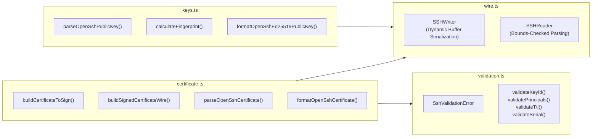

import { Badge } from '@astrojs/starlight/components';

The `apps/api/src/lib/ssh/` module provides a zero-dependency TypeScript implementation of RFC 4251 binary serialization, OpenSSH public key parsing, Ed25519 user certificate minting, and strict POSIX sanitization.

---

## Architecture Overview



---

## 1. `SSHWriter` (`apps/api/src/lib/ssh/wire.ts`)

Builds RFC 4251 binary buffers using dynamic `Uint8Array` allocation and big-endian `DataView`.

```ts
import { SSHWriter } from "@/lib/ssh/wire";

const writer = new SSHWriter(512); // Default capacity: 512 bytes
```

### Constructor

| Parameter | Type | Default | Description |
| :--- | :--- | :--- | :--- |
| `initialCapacity` | `number` | `512` | Initial byte capacity allocated for the internal `Uint8Array`. Automatically doubles when capacity is exceeded. |

### Methods

#### `writeUint32(value: number): this`
Writes a 32-bit unsigned integer in network byte order (big-endian).
- **`value`**: Non-negative integer in range `[0, 2^32 - 1]`.
- **Memory**: Consumes exactly 4 bytes via `view.setUint32(offset, value, false)`.

#### `writeUint64(value: bigint): this`
Writes a 64-bit unsigned integer in network byte order (big-endian).
- **`value`**: Non-negative `bigint` in range `[0, 2^64 - 1]`.
- **Memory**: Consumes exactly 8 bytes via `view.setBigUint64(offset, value, false)`.

#### `writeString(value: string): this`
Encodes a UTF-8 string prefixed by its 4-byte big-endian `uint32` byte length.
- **`value`**: String to encode.
- **Memory**: Consumes `4 + byteLength` bytes.

#### `writeBytes(value: Uint8Array): this`
Encodes a raw byte buffer prefixed by its 4-byte big-endian `uint32` byte length.
- **`value`**: `Uint8Array` to encode.
- **Memory**: Consumes `4 + value.length` bytes.

#### `writeRaw(value: Uint8Array): this`
Appends raw bytes directly to the buffer without writing a length prefix.
- **`value`**: `Uint8Array` to append directly.
- **Memory**: Consumes exactly `value.length` bytes.

#### `toUint8Array(): Uint8Array`
Returns a zero-copy subarray view of all written bytes (`this.buffer.subarray(0, this.offset)`).

---

## 2. `SSHReader` (`apps/api/src/lib/ssh/wire.ts`)

Parses RFC 4251 binary buffers sequentially with strict bounds checking.

```ts
import { SSHReader } from "@/lib/ssh/wire";

const reader = new SSHReader(wireBytes);
```

### Properties

| Property | Type | Description |
| :--- | :--- | :--- |
| `remaining` | `number` | Number of unread bytes remaining in the buffer. |

### Methods

#### `hasRemaining(): boolean`
Returns `true` if more bytes remain to be consumed (`this.offset < this.buffer.length`).

#### `readUint32(): number`
Reads and consumes a 4-byte unsigned 32-bit integer in big-endian byte order. Throws `Error("Unexpected end of SSH wire buffer")` if fewer than 4 bytes remain.

#### `readUint64(): bigint`
Reads and consumes an 8-byte unsigned 64-bit `bigint` in big-endian byte order. Throws `Error` if fewer than 8 bytes remain.

#### `readBytes(): Uint8Array`
Reads a 4-byte length prefix and consumes that many raw payload bytes. Returns a zero-copy subarray view.

#### `readString(): string`
Reads a 4-byte length prefix, consumes that many payload bytes, and decodes them as a UTF-8 string via `TextDecoder`.

#### `readRemaining(): Uint8Array`
Consumes and returns all remaining bytes in the buffer as a subarray view.

---

## 3. Certificate Functions (`apps/api/src/lib/ssh/certificate.ts`)

### Data Structures

```ts
export interface CertificateSigningData {
    rawClientPublicKey: Uint8Array;       // 32 bytes raw Ed25519 public key
    serial: bigint;                       // 64-bit monotonic serial number
    type?: 1 | 2;                         // 1 = User (default), 2 = Host
    keyId: string;                        // Human-readable identity (e.g. email)
    principals: string[];                 // Authorized UNIX usernames
    validAfter: bigint;                   // UNIX epoch seconds
    validBefore: bigint;                  // UNIX epoch seconds
    criticalOptions?: Record<string, string>;
    extensions?: string[] | Record<string, string>;
    caPublicWire: Uint8Array;             // Pre-encoded CA public key wire blob
    nonce?: Uint8Array;                   // Optional 16-byte random nonce
}

export interface ParsedOpenSshCertificate {
    certType: string;                     // "ssh-ed25519-cert-v01@openssh.com"
    nonce: Uint8Array;
    rawClientPublicKey: Uint8Array;
    serial: bigint;
    type: number;                         // 1 = User, 2 = Host
    keyId: string;
    principals: string[];
    validAfter: bigint;
    validBefore: bigint;
    criticalOptions: Record<string, string>;
    extensions: Record<string, string>;
    caPublicWire: Uint8Array;
    caSignature: {
        algorithm: string;
        signature: Uint8Array;            // 64 bytes raw Ed25519 signature
    };
}
```

### Functions

#### `buildCertificateToSign(data: CertificateSigningData): Uint8Array`
Serializes fields 1 through 13 into the pre-signature byte stream signed by the CA private key.
- **Validation**: Enforces that `rawClientPublicKey` is exactly 32 bytes.
- **Returns**: Binary `Uint8Array` ready for `crypto.subtle.sign`.

#### `buildSignedCertificateWire(toSign: Uint8Array, rawSignature: Uint8Array, sigAlgorithm = "ssh-ed25519"): Uint8Array`
Combines the pre-signature body with the CA's signature block into a complete OpenSSH certificate wire blob.
- **`toSign`**: Output from `buildCertificateToSign`.
- **`rawSignature`**: 64-byte Ed25519 signature from `crypto.subtle.sign`.
- **`sigAlgorithm`**: Defaults to `"ssh-ed25519"`.

#### `formatOpenSshCertificate(certWireBytes: Uint8Array, comment?: string): string`
Encodes binary certificate wire bytes into the standard single-line string format (`ssh-ed25519-cert-v01@openssh.com <base64> [comment]\n`).

#### `parseOpenSshCertificate(input: string | Uint8Array): ParsedOpenSshCertificate`
Deserializes and validates a binary wire blob or single-line base64 certificate string into structured fields.

---

## 4. Key Management Functions (`apps/api/src/lib/ssh/keys.ts`)

#### `parseOpenSshPublicKey(keyString: string): ParsedSshPublicKey`
Parses and validates an OpenSSH single-line public key string (`<algorithm> <base64> [comment]`).
- **Throws**: `SshValidationError` if the string is empty, lacks base64 content, or specifies an unsupported algorithm (only `ssh-ed25519` is accepted).

#### `calculateFingerprint(wireBytes: Uint8Array): Promise<string>`
Calculates the canonical OpenSSH SHA-256 fingerprint:
```ts
const hashBuffer = await crypto.subtle.digest("SHA-256", wireBytes);
return `SHA256:${base64Encode(new Uint8Array(hashBuffer), true)}`;
// Returns: "SHA256:abc123xyz..." (without trailing '=' padding)
```

#### `formatOpenSshEd25519PublicKey(rawPublicKey: Uint8Array, comment?: string): string`
Formats a 32-byte raw public key into an OpenSSH `.pub` line (`ssh-ed25519 <base64> [comment]\n`).

#### `buildEd25519PublicWire(rawPublicKey: Uint8Array): Uint8Array`
Builds the 51-byte OpenSSH wire blob for an Ed25519 public key (`string` `"ssh-ed25519"` + `bytes` 32-byte key).

---

## 5. Security Validation (`apps/api/src/lib/ssh/validation.ts`)

The validation layer guarantees strict input sanitization to eliminate command injection, log forging, and parser confusion:

```ts
export class SshValidationError extends Error {
    constructor(
        message: string,
        public readonly code:
            | "INVALID_KEY_FORMAT"
            | "INVALID_KEY_LENGTH"
            | "UNSUPPORTED_ALGORITHM"
            | "INVALID_KEY_ID"
            | "INVALID_PRINCIPALS"
            | "INVALID_TTL"
            | "INVALID_EXTENSION"
            | "INVALID_CRITICAL_OPTION"
            | "INVALID_SERIAL",
    ) { ... }
}
```

### Validator Catalog

| Function | Validation Rules | Error Code |
| :--- | :--- | :--- |
| **`validateKeyId(keyId)`** | Length: 1–256 characters. Printable ASCII (`[\x20-\x7E]`) only. Rejects newlines, carriage returns, and control codes to prevent syslog forging. | `INVALID_KEY_ID` |
| **`validatePrincipals(principals)`** | Array must contain 1–64 usernames. Each principal matches `^[a-zA-Z0-9_.][a-zA-Z0-9_.-]{0,63}$`. Cannot start with a hyphen (prevents CLI option injection). Rejects commas, colons, and spaces. | `INVALID_PRINCIPALS` |
| **`validateTtl(ttl, maxTtl)`** | Must be positive integer between 60 seconds (1 min) and `maxTtl` (default 86,400s / 24 hrs). | `INVALID_TTL` |
| **`validateSerial(serial)`** | Must be non-negative 64-bit integer (`0 <= serial <= 2^64 - 1`). | `INVALID_SERIAL` |
| **`validateEd25519RawKey(key)`** | Must be `Uint8Array` of length exactly 32 bytes. | `INVALID_KEY_LENGTH` |
