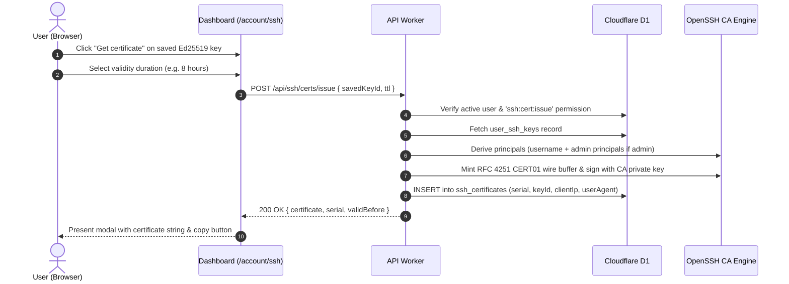

import { Steps } from '@astrojs/starlight/components';

Traditional SSH keys require manually distributing public keys into every destination host's `~/.ssh/authorized_keys`. With the Muljax ID Certificate Authority, your public key is signed by the CA into a temporary **certificate**, granting instant access to all hosts that trust the CA.

## Certificate Issuance Ceremony



---

## Requesting via the Dashboard

<Steps>

1. In the dashboard, navigate to **Account** -> **SSH Keys** (`/account/ssh`).

2. Locate your registered public key.

3. Click the **Get certificate** button next to the key.

4. Select the desired certificate duration (defaults to 8 hours).

5. Click **Issue certificate**.

6. A modal opens with your signed certificate string (`ssh-ed25519-cert-v01@openssh.com ...`).

7. Click **Copy certificate**.

</Steps>

---

## Saving the Certificate

Save the copied certificate to your local `~/.ssh/` directory with `-cert.pub` appended to your private key name:

```sh
cat << 'EOF' > ~/.ssh/id_ed25519-cert.pub
<paste certificate content here>
EOF
chmod 644 ~/.ssh/id_ed25519-cert.pub
```

---

## Inspecting the Certificate

Use OpenSSH's built-in `ssh-keygen` command to inspect all fields of the generated certificate:

```sh
ssh-keygen -L -f ~/.ssh/id_ed25519-cert.pub
```

Example output:
```text
~/.ssh/id_ed25519-cert.pub:
        Type: ssh-ed25519-cert-v01@openssh.com user certificate
        Public key: ED25519 SHA256:gZ5R...
        Signing CA: ED25519 SHA256:vT3K... (ca@id.example.com)
        Key ID: "alice@example.com-1773767800"
        Serial: 117284521030851699
        Valid: from 2026-09-17T12:00:00 to 2026-09-17T20:00:00
        Principals:
                alice
        Critical Options: (none)
        Extensions:
                permit-X11-forwarding
                permit-agent-forwarding
                permit-port-forwarding
                permit-pty
                permit-user-rc
```
